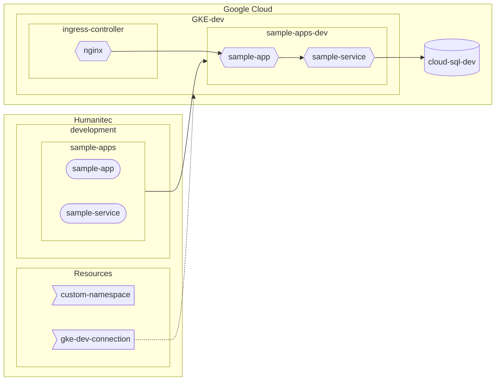
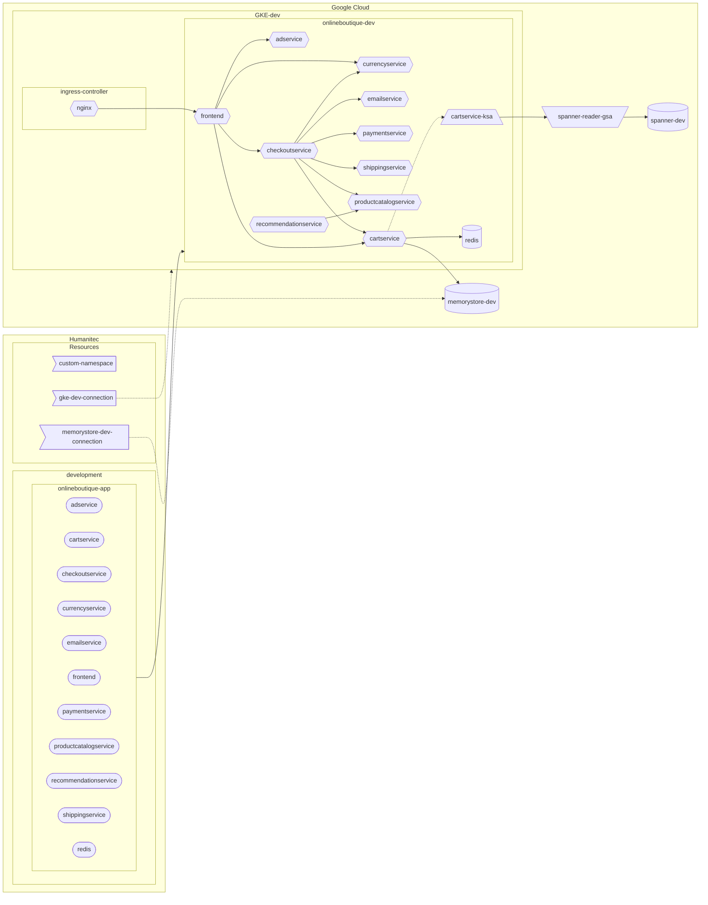

# hello-humanitec

## Sample Apps



## Online Boutique



```
PROJECT_ID=FIXME
gcloud config set project ${PROJECT_ID}
CLUSTER_NAME=gke-dev
REGION=northamerica-northeast1
ZONE=${REGION}-a
```

## Minimum setup:
```
gcloud services enable container.googleapis.com

gcloud container clusters create ${CLUSTER_NAME} \
    --zone ${ZONE} \
    --workload-pool=${PROJECT_ID}.svc.id.goog \
    --enable-master-authorized-networks \
    --master-authorized-networks 34.159.97.57/32,35.198.74.96/32,34.141.77.162/32,34.89.188.214/32,34.159.140.35/32,34.89.165.141/32 \
    --no-enable-google-cloud-access
```

## Advanced setup:
```
gcloud services enable container.googleapis.com
gcloud services enable containersecurity.googleapis.com

gcloud container clusters create ${CLUSTER_NAME} \
    --zone ${ZONE} \
    --workload-pool=${PROJECT_ID}.svc.id.goog \
    --enable-master-authorized-networks \
    --master-authorized-networks 34.159.97.57/32,35.198.74.96/32,34.141.77.162/32,34.89.188.214/32,34.159.140.35/32,34.89.165.141/32 \
    --no-enable-google-cloud-access \
    --enable-workload-vulnerability-scanning \
    --enable-workload-config-audit
```
