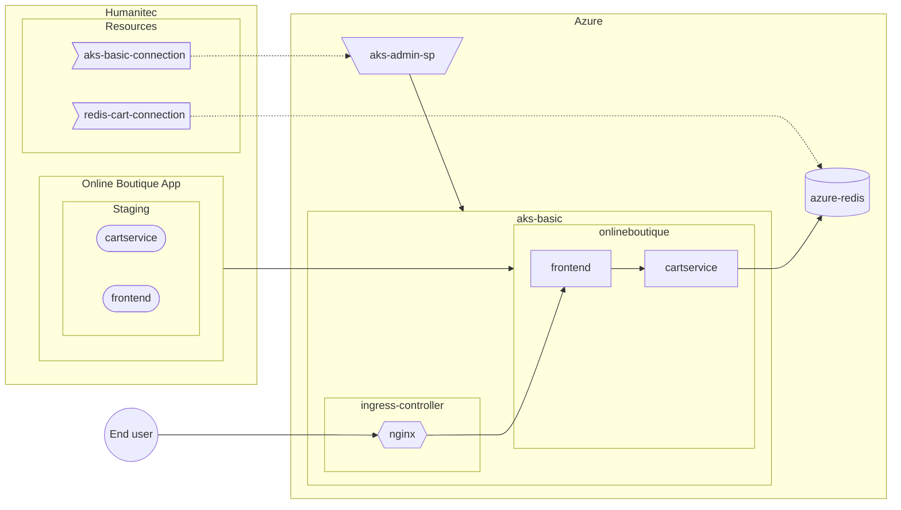

[_<< Previous section: Common setup_](/docs/common.md)

| [_Next section: GKE advanced setup in Production >>_](/docs/gke-advanced.md)

# AKS basic setup in Staging

- [[PA-AZ] Create the AKS cluster](#pa-az-create-the-aks-cluster)
- [[PA-AZ] Deploy the Nginx Ingress controller](#pa-az-deploy-the-nginx-ingress-controller)
- [[PA-AZ] Create the Service Principal to access the AKS cluster](#pa-az-create-the-service-principal-to-access-the-aks-cluster)
- [[PA-HUM] Create the GKE access resource definition](#pa-hum-create-the-gke-access-resource-definition)
- [[PA-HUM] Create the Staging Environment](#pa-hum-create-the-staging-environment)
- [[PA-AZ] Create an Azure Redis Cache database](#pa-az-create-an-azure-redis-cache-database)
- [[PA-HUM] Create the Azure Redis Cache access resource definition](#pa-hum-create-the-azure-redis-cache-access-resource-definition)
- [[PA-HUM] Deploy the Staging Environment](#pa-hum-deploy-the-staging-environment)
- [Test the Online Boutique website](#test-the-online-boutique-website)



```bash
SUBSCRIPTION_ID=FIXME
RESOURCE_GROUP=FIXME
CLUSTER_NAME=aks-basic
LOCATION=canadacentral
NETWORK=default
HUMANITEC_IP_ADDRESSES="34.159.97.57/32,35.198.74.96/32,34.141.77.162/32,34.89.188.214/32,34.159.140.35/32,34.89.165.141/32"
LOCAL_IP_ADRESS=$(curl -s checkip.dyndns.org | sed -e 's/.*Current IP Address: //' -e 's/<.*$//')

HUMANITEC_ORG=FIXME
export HUMANITEC_CONTEXT=/orgs/${HUMANITEC_ORG}
export HUMANITEC_TOKEN=FIXME

ENVIRONMENT=${STAGING_ENV}-aks
```

## [PA-AZ] Create the AKS cluster

As Platform Admin, in Azure.

```bash
az provider register \
    -n Microsoft.ContainerService
```

```bash
az aks create \
    -g ${RESOURCE_GROUP} \
    -n ${CLUSTER_NAME} \
    -l ${LOCATION} \
    --node-count 3 \
    --api-server-authorized-ip-ranges ${HUMANITEC_IP_ADDRESSES},${LOCAL_IP_ADRESS}/32 \
    --no-ssh-key
```

```bash
az aks get-credentials \
    -g ${RESOURCE_GROUP} \
    -n ${CLUSTER_NAME}
```

## [PA-AZ] Deploy the Nginx Ingress controller

As Platform Admin, in Azure.

Deploy the Nginx Ingress Controller:
```bash
helm upgrade \
    --install ingress-nginx ingress-nginx \
    --repo https://kubernetes.github.io/ingress-nginx \
    --namespace ingress-nginx \
    --create-namespace \
    --set controller.service.annotations."service\.beta\.kubernetes\.io/azure-load-balancer-health-probe-request-path"=/healthz
```

Grab the Public IP address of that Ingress Controller:
```bash
INGRESS_IP=$(kubectl get svc ingress-nginx-controller \
    -n ingress-nginx \
    -o jsonpath="{.status.loadBalancer.ingress[*].ip}")
echo ${INGRESS_IP}
```
_Note: re-run the above command until you get a value._

## [PA-AZ] Create the Service Principal to access the AKS cluster

As Platform Admin, in Azure.

Create the Service Principal with the appropriate role:
```bash
AKS_ADMIN_SP_NAME=humanitec-to-${CLUSTER_NAME}

AKS_ADMIN_SP_CREDENTIALS=$(az ad sp create-for-rbac \
    -n ${AKS_ADMIN_SP_NAME})
AKS_ADMIN_SP_ID=$(echo ${AKS_ADMIN_SP_CREDENTIALS} | jq -r .appId)
AKS_ID=$(az aks show \
    -n ${CLUSTER_NAME} \
    -g ${RESOURCE_GROUP} \
    -o tsv \
    --query id)
az role assignment create \
    --role "Azure Kubernetes Service RBAC Cluster Admin" \
    --assignee ${AKS_ADMIN_SP_ID} \
    --scope ${AKS_ID}
```

## [PA-HUM] Create the AKS access resource definition

As Platform Admin, in Humanitec.

Create the AKS access resource definition:
```bash
cat <<EOF > ${CLUSTER_NAME}.yaml
apiVersion: core.api.humanitec.io/v1
kind: Definition
metadata:
  id: ${CLUSTER_NAME}
object:
  name: ${CLUSTER_NAME}
  type: k8s-cluster
  driver_type: humanitec/k8s-cluster-aks
  driver_inputs:
    values:
      loadbalancer: ${INGRESS_IP}
      name: ${CLUSTER_NAME}
      resource_group: ${RESOURCE_GROUP}
      subscription_id: ${SUBSCRIPTION_ID}
    secrets:
      credentials: ${AKS_ADMIN_SP_CREDENTIALS}
  criteria:
    - env_id: ${ENVIRONMENT}
EOF
sed "s/\"displayName\": \"${AKS_ADMIN_SP_NAME}\"/\"name\": \"$(echo ${AKS_ADMIN_SP_CREDENTIALS} | jq -r .appId)\"/" ${CLUSTER_NAME}.yaml
humctl create \
    -f ${CLUSTER_NAME}.yaml
```
<details>
  <summary>With curl.</summary>

  ```bash
  cat <<EOF > ${CLUSTER_NAME}.yaml
  id: ${CLUSTER_NAME}
  name: ${CLUSTER_NAME}
  type: k8s-cluster
  driver_type: humanitec/k8s-cluster-aks
  driver_inputs:
    values:
      loadbalancer: ${INGRESS_IP}
      name: ${CLUSTER_NAME}
      resource_group: ${RESOURCE_GROUP}
      subscription_id: ${SUBSCRIPTION_ID}
    secrets:
      credentials: ${AKS_ADMIN_SP_CREDENTIALS}
  criteria:
    - env_id: ${ENVIRONMENT}
  EOF
  sed "s/\"displayName\": \"${AKS_ADMIN_SP_NAME}\"/\"name\": \"$(echo ${AKS_ADMIN_SP_CREDENTIALS} | jq -r .appId)\"/" ${CLUSTER_NAME}.yaml
  yq -o json ${CLUSTER_NAME}.yaml > ${CLUSTER_NAME}.json
  curl "https://api.humanitec.io/orgs/${HUMANITEC_ORG}/resources/defs" \
      -X POST \
      -H "Content-Type: application/json" \
      -H "Authorization: Bearer ${HUMANITEC_TOKEN}" \
      -d @${CLUSTER_NAME}.json
  ```
</details>

Clean sensitive information locally:
```bash
rm ${CLUSTER_NAME}.yaml
rm ${CLUSTER_NAME}.json
```

## [PA-HUM] Create the Staging Environment

As Platform Admin, in Humanitec.

Create the new Environment by cloning the existing Environment from its latest Deployment:
```bash
CLONED_ENVIRONMENT=development
humctl create environment ${ENVIRONMENT} \
    --name Staging-AKS \
    -t ${STAGING_ENV} \
    --context /orgs/${HUMANITEC_ORG}/apps/${ONLINEBOUTIQUE_APP} \
    --from ${CLONED_ENVIRONMENT}
```
<details>
  <summary>With curl.</summary>

  Get the latest Deployment's id of the existing Environment:
  ```bash
  CLONED_ENVIRONMENT=development
  LAST_DEPLOYMENT_IN_CLONED_ENVIRONMENT=$(curl "https://api.humanitec.io/orgs/${HUMANITEC_ORG}/apps/${ONLINEBOUTIQUE_APP}/envs/${CLONED_ENVIRONMENT}/deploys" \
      -s \
      -H "Authorization: Bearer ${HUMANITEC_TOKEN}" \
      -H "Content-Type: application/json" \
      | jq -r .[0].id)
  ```

  Create the new Environment by cloning the existing Environment from its latest Deployment:
  ```bash
  cat <<EOF > ${ONLINEBOUTIQUE_APP}-${ENVIRONMENT}-env.yaml
  from_deploy_id: ${LAST_DEPLOYMENT_IN_CLONED_ENVIRONMENT}
  id: ${ENVIRONMENT}
  name: Staging
  type: ${ENVIRONMENT}
  EOF
  yq -o json ${ONLINEBOUTIQUE_APP}-${ENVIRONMENT}-env.yaml > ${ONLINEBOUTIQUE_APP}-${ENVIRONMENT}-env.json
  curl "https://api.humanitec.io/orgs/${HUMANITEC_ORG}/apps/${ONLINEBOUTIQUE_APP}/envs" \
      -X POST \
      -H "Content-Type: application/json" \
      -H "Authorization: Bearer ${HUMANITEC_TOKEN}" \
      -d @${ONLINEBOUTIQUE_APP}-${ENVIRONMENT}-env.json
  ```
</details>

Deploy the new Environment:
```bash
humctl deploy env ${CLONED_ENVIRONMENT} ${ENVIRONMENT} \
    --context /orgs/${HUMANITEC_ORG}/apps/${ONLINEBOUTIQUE_APP}
```

At this stage, you can already [test the Online Boutique website](#test-the-online-boutique-website) in its existing state.

## [PA-AZ] Create an Azure Redis Cache database

As Platform Admin, in Azure.

Create the Azure Redis Cache database:
```bash
REDIS_NAME=redis-cart-${ENVIRONMENT}
REDIS_SKU="basic"
REDIS_SIZE="C0"

az provider register \
    -n Microsoft.Cache

az redis create \
    -n ${REDIS_NAME} \
    -g ${RESOURCE_GROUP} \
    -l ${LOCATION} \
    --sku ${REDIS_SKU} \
    --vm-size ${REDIS_SIZE}
```

```bash
REDIS_HOST=$(az redis show \
    -n ${REDIS_NAME} \
    -g ${RESOURCE_GROUP} \
    --query [hostName] \
    -o tsv)
echo ${REDIS_HOST}
REDIS_PORT=$(az redis show \
    -n ${REDIS_NAME} \
    -g ${RESOURCE_GROUP} \
    --query [sslPort] \
    --output tsv)
echo ${REDIS_PORT}
REDIS_AUTH=$(az redis list-keys \
    -n ${REDIS_NAME} \
    -g ${RESOURCE_GROUP} \
    --query [primaryKey] \
    --output tsv)
echo ${REDIS_AUTH}
```
_Note: re-run the above commands until you get the 3 values._

## [PA-HUM] Create the Azure Redis Cache access resource definition

As Platform Admin, in Humanitec.

```bash
cat <<EOF > ${REDIS_NAME}.yaml
apiVersion: core.api.humanitec.io/v1
kind: Definition
metadata:
  id: ${REDIS_NAME}
object:
  name: ${REDIS_NAME}
  type: redis
  driver_type: humanitec/static
  driver_inputs:
    values:
      host: ${REDIS_HOST}
      port: ${REDIS_PORT}
    secrets:
      password: ${REDIS_AUTH}
  criteria:
    - env_id: ${ENVIRONMENT}
EOF
humctl create \
    -f ${REDIS_NAME}.yaml
```
<details>
  <summary>With curl.</summary>

  ```bash
  cat <<EOF > ${REDIS_NAME}.yaml
  id: ${REDIS_NAME}
  name: ${REDIS_NAME}
  type: redis
  driver_type: humanitec/static
  driver_inputs:
    values:
      host: ${REDIS_HOST}
      port: ${REDIS_PORT}
    secrets:
      password: ${REDIS_AUTH}
  criteria:
    - env_id: ${ENVIRONMENT}
  EOF
  yq -o json ${REDIS_NAME}.yaml > ${REDIS_NAME}.json
  curl "https://api.humanitec.io/orgs/${HUMANITEC_ORG}/resources/defs" \
      -X POST \
      -H "Content-Type: application/json" \
      -H "Authorization: Bearer ${HUMANITEC_TOKEN}" \
      -d @${REDIS_NAME}.json
```
</details>

Clean sensitive information locally:
```bash
rm ${REDIS_NAME}.yaml
```

## [PA-HUM] Deploy the Staging Environment

As Platform admin, in Humanitec.

Deploy the new Environment to take into account all the new resource definitions:
```bash
humctl deploy env ${ENVIRONMENT} ${ENVIRONMENT} \
    --context /orgs/${HUMANITEC_ORG}/apps/${ONLINEBOUTIQUE_APP}
```

## Test the Online Boutique website

Get the public DNS exposing the `frontend` Workload:
```bash
echo -e "https://$(humctl get active-resources \
    --context /orgs/${HUMANITEC_ORG}/apps/${ONLINEBOUTIQUE_APP}/envs/${ENVIRONMENT} \
    -o json \
    | jq -c '.[] | select(.object.type | contains("dns"))' \
    | jq -r .object.resource.host)"
```
<details>
  <summary>With curl.</summary>
  
  ```bash
  echo -e "https://$(curl "https://api.humanitec.io/orgs/${HUMANITEC_ORG}/apps/${ONLINEBOUTIQUE_APP}/envs/${ENVIRONMENT}/resources" \
      -s \
      -H "Authorization: Bearer ${HUMANITEC_TOKEN}" \
      -H "Content-Type: application/json" \
      | jq -c '.[] | select(.type | contains("dns"))' \
      | jq -r .resource.host)"
  ```
</details>

_Note: re-run the above command until you get a value._

[_<< Previous section: Common setup_](/docs/common.md)

| [_Next section: GKE advanced setup in Production >>_](/docs/gke-advanced.md)
