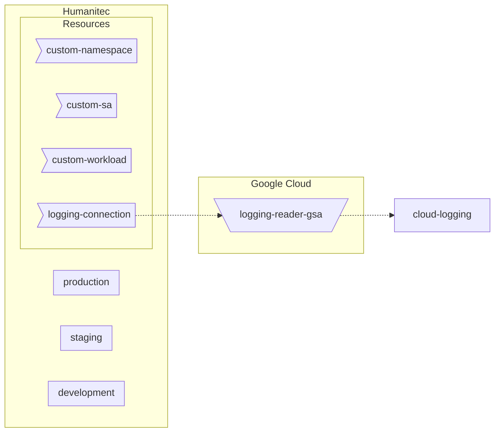

## Common setup



```bash
PROJECT_ID=FIXME
gcloud config set project ${PROJECT_ID}
```

### GSA to access Cloud Logging

```bash
LOGGING_READER_SA_NAME=humanitec-logging-dev
LOGGING_READER_SA_ID=${LOGGING_READER_SA_NAME}@${PROJECT_ID}.iam.gserviceaccount.com
gcloud iam service-accounts create ${LOGGING_READER_SA_NAME} \
	--display-name=${LOGGING_READER_SA_NAME}
gcloud projects add-iam-policy-binding ${PROJECT_ID} \
	--member "serviceAccount:${LOGGING_READER_SA_ID}" \
	--role "roles/logging.viewer"
```

Let’s download locally the GSA key:
```bash
gcloud iam service-accounts keys create ${LOGGING_READER_SA_NAME}.json \
    --iam-account ${LOGGING_READER_SA_ID}
```
