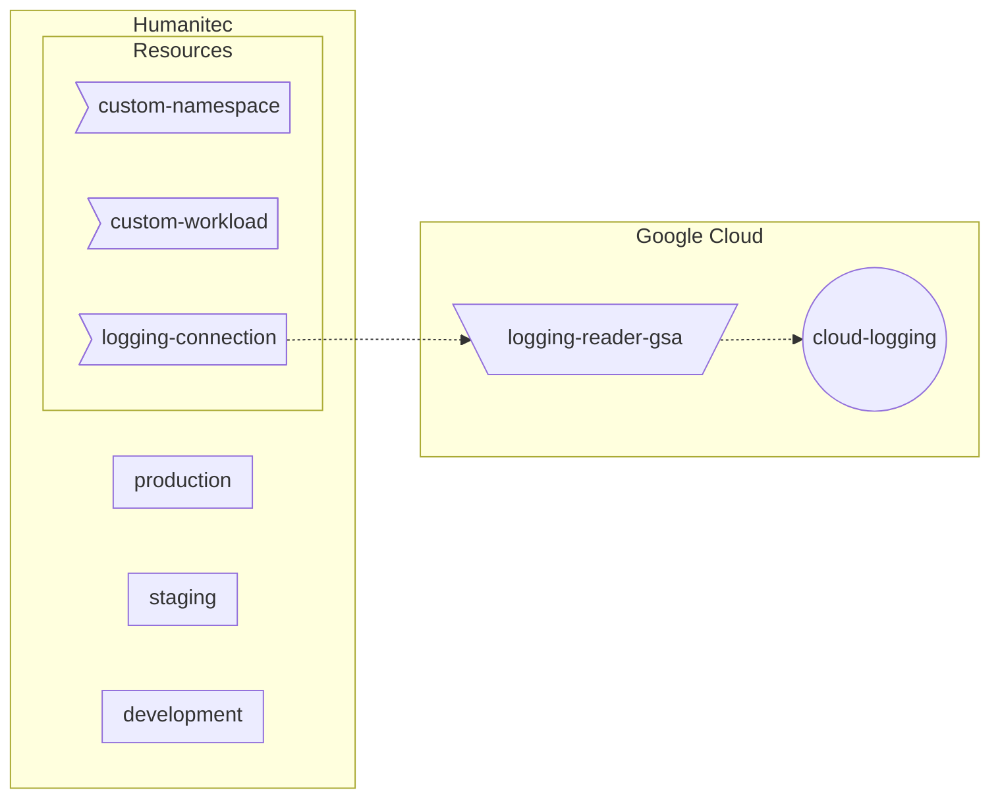

## Common setup



- [GSA to access Cloud Logging](#gsa-to-access-cloud-logging)
- [Custom Workload resource definition](#custom-workload-resource-definition)

```bash
PROJECT_ID=FIXME
gcloud config set project ${PROJECT_ID}

HUMANITEC_ORG=FIXME
HUMANITEC_TOKEN=FIXME
```

### GSA to access Cloud Logging

```bash
LOGGING_READER_SA_NAME=humanitec-logging-dev
LOGGING_READER_SA_ID=${LOGGING_READER_SA_NAME}@${PROJECT_ID}.iam.gserviceaccount.com
gcloud iam service-accounts create ${LOGGING_READER_SA_NAME} \
	--display-name=${LOGGING_READER_SA_NAME}
gcloud projects add-iam-policy-binding ${PROJECT_ID} \
	--member "serviceAccount:${LOGGING_READER_SA_ID}" \
	--role "roles/logging.viewer"
```

Let’s download locally the GSA key:
```bash
gcloud iam service-accounts keys create ${LOGGING_READER_SA_NAME}.json \
    --iam-account ${LOGGING_READER_SA_ID}
```

### Custom Workload resource definition

```bash
cat <<EOF > custom-workload.yaml
id: custom-workload
name: custom-workload
type: workload
driver_type: humanitec/template
driver_inputs:
  values:
    templates:
      init: |
        serviceAccountName: \${context.env.id}-\${context.app.id}-\${context.res.id}
      manifests: |
        service-account.yaml:
          location: namespace
          data:
            apiVersion: v1
            kind: ServiceAccount
            metadata:
              name: {{ .init.serviceAccountName }}
      outputs: |
        update:
          - op: add
            path: /spec/automountServiceAccountToken
            value: false
	  - op: add
            path: /spec/serviceAccountName
            value: {{ .init.serviceAccountName }}
          - op: add
            path: /spec/securityContext
            value:
              seccompProfile:
                type: RuntimeDefault
              runAsNonRoot: true
              fsGroup: 1000
              runAsGroup: 1000
              runAsUser: 1000
          {{- range \$containerId, \$value := .resource.spec.containers }}
          - op: add
            path: /spec/containers/{{ \$containerId }}/securityContext
            value:
              privileged: false
              allowPrivilegeEscalation: false
              readOnlyRootFilesystem: true
              capabilities:
                drop:
                  - ALL
          {{- end }}
criteria:
  - {}
EOF
yq -o json custom-workload.yaml > custom-workload.json
curl -X POST "https://api.humanitec.io/orgs/${HUMANITEC_ORG}/resources/defs" \
  	-H "Content-Type: application/json" \
	-H "Authorization: Bearer ${HUMANITEC_TOKEN}" \
  	-d @custom-workload.json
```
