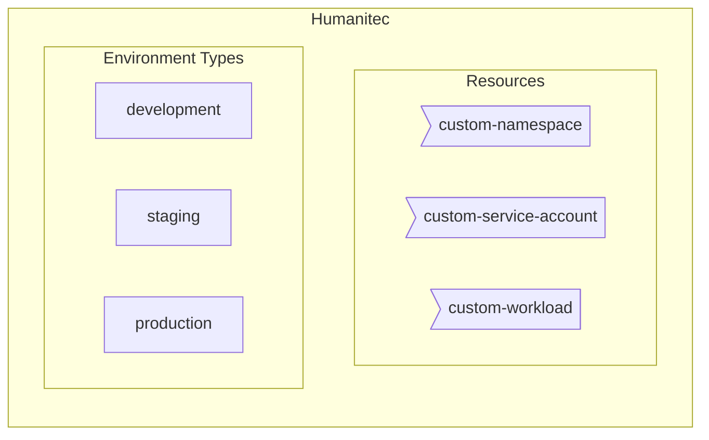

[_<< Previous section: Humanitec default setup in Development_](/docs/humanitec-default.md) | [_Next section: GKE basic setup in Staging >>_](/docs/gke-basic.md)

## Common setup

- [[PA-HUM] Create `staging` and `production` Environment types](#pa-hum-create-staging-and-production-environment-types)
- [[PA-HUM] Create a custom `Namespace` resource definition](#pa-hum-create-a-custom-namespace-resource-definition)
- [[PA-HUM] Create a custom `ServiceAccount` resource definition](#pa-hum-create-a-custom-serviceaccount-resource-definition)
- [[PA-HUM] Create a custom Workload resource definition](#pa-hum-create-a-custom-workload-resource-definition)



```bash
HUMANITEC_ORG=FIXME
export HUMANITEC_CONTEXT=/orgs/${HUMANITEC_ORG}
export HUMANITEC_TOKEN=FIXME
```

### [PA-HUM] Create `staging` and `production` Environment types

The `development` Environment type is already created by default in Humanitec.

Create the `staging` Environment type:
```bash
STAGING_ENV="staging"
humctl create environment-type ${STAGING_ENV} \
    --description "Environment type for ${STAGING_ENV}."
```
<details>
  <summary>With curl.</summary>

  ```bash
  curl https://api.humanitec.io/orgs/${HUMANITEC_ORG}/env-types \
    -X POST \
    -H "Authorization: Bearer ${HUMANITEC_TOKEN}" \
    -H "Content-Type: application/json" \
    -d @- <<EOF
  {
    "id": "${STAGING_ENV}",
    "description": "Environment type for ${STAGING_ENV}."
  }
  EOF
  ```
</details>

Create the `production` Environment type:
```bash
PRODUCTION_ENV="production"
humctl create environment-type ${PRODUCTION_ENV} \
    --description "Environment type for ${PRODUCTION_ENV}."
```
<details>
  <summary>With curl.</summary>

  ```bash
  curl https://api.humanitec.io/orgs/${HUMANITEC_ORG}/env-types \
    -X POST \
    -H "Authorization: Bearer ${HUMANITEC_TOKEN}" \
    -H "Content-Type: application/json" \
    -d @- <<EOF
  {
    "id": "${PRODUCTION_ENV}",
    "description": "Environment type for ${PRODUCTION_ENV}."
  }
  EOF
  ```
</details>

### [PA-HUM] Create a custom `Namespace` resource definition

As Platform Admin, in Humanitec.

Customize the name of the Kubernetes `Namespace` for all our Apps ([reference](https://docs.humanitec.com/guides/orchestrate-infrastructure/define-namespaces)). One per App/Env. We also adding the label to enforce [Pod Security Standards `restricted`](https://kubernetes.io/docs/concepts/security/pod-security-standards/):
```bash
cat <<EOF > custom-namespace.yaml
apiVersion: core.api.humanitec.io/v1
kind: Definition
metadata:
  id: custom-namespace
object:
  name: custom-namespace
  type: k8s-namespace
  driver_type: humanitec/template
  driver_inputs:
    values:
      templates:
        init: |
          name: \${context.env.id}-\${context.app.id}
        manifests: |-
          namespace.yaml:
            location: cluster
            data:
              apiVersion: v1
              kind: Namespace
              metadata:
                labels:
                  pod-security.kubernetes.io/enforce: restricted
                name: {{ .init.name }}
        outputs: |
          namespace: {{ .init.name }}
  criteria:
    - env_type: ${STAGING_ENV}
    - env_type: ${PRODUCTION_ENV}
EOF
humctl create \
    -f custom-namespace.yaml
```
<details>
  <summary>With curl.</summary>

  ```bash
  cat <<EOF > custom-namespace.yaml
  id: custom-namespace
  name: custom-namespace
  type: k8s-namespace
  driver_type: humanitec/template
  driver_inputs:
    values:
      templates:
        init: |
          name: \${context.env.id}-\${context.app.id}
        manifests: |-
          namespace.yaml:
            location: cluster
            data:
              apiVersion: v1
              kind: Namespace
              metadata:
                labels:
                  pod-security.kubernetes.io/enforce: restricted
                name: {{ .init.name }}
        outputs: |
          namespace: {{ .init.name }}
  criteria:
    - env_type: ${STAGING_ENV}
    - env_type: ${PRODUCTION_ENV}
  EOF
  yq -o json custom-namespace.yaml > custom-namespace.json
  curl "https://api.humanitec.io/orgs/${HUMANITEC_ORG}/resources/defs" \
      -X POST \
      -H "Content-Type: application/json" \
      -H "Authorization: Bearer ${HUMANITEC_TOKEN}" \
      -d @custom-namespace.json
  ```
</details>

### [PA-HUM] Create a custom `ServiceAccount` resource definition

As Platform Admin, in Humanitec.

Create a dedicated Kubernetes `ServiceAccount` for all our Apps, one per Workload:
```bash
cat <<EOF > custom-service-account.yaml
apiVersion: core.api.humanitec.io/v1
kind: Definition
metadata:
  id: custom-service-account
object:
  name: custom-service-account
  type: k8s-service-account
  driver_type: humanitec/template
  driver_inputs:
    values:
      templates:
        init: |
          name: {{ index (regexSplit "\\\\." "\$\${context.res.id}" -1) 1 }}
        manifests: |-
          service-account.yaml:
            location: namespace
            data:
              apiVersion: v1
              kind: ServiceAccount
              metadata:
                name: {{ .init.name }}
        outputs: |
          name: {{ .init.name }}
  criteria:
    - {}
EOF
humctl create \
    -f custom-service-account.yaml
```
<details>
  <summary>With curl.</summary>

  ```bash
  cat <<EOF > custom-service-account.yaml
  id: custom-service-account
  name: custom-service-account
  type: k8s-service-account
  driver_type: humanitec/template
  driver_inputs:
    values:
      templates:
        init: |
          name: {{ index (regexSplit "\\\\." "\$\${context.res.id}" -1) 1 }}
        manifests: |-
          service-account.yaml:
            location: namespace
            data:
              apiVersion: v1
              kind: ServiceAccount
              metadata:
                name: {{ .init.name }}
        outputs: |
          name: {{ .init.name }}
  criteria:
    - {}
  EOF
  yq -o json custom-service-account.yaml > custom-service-account.json
  curl "https://api.humanitec.io/orgs/${HUMANITEC_ORG}/resources/defs" \
      -X POST \
      -H "Content-Type: application/json" \
      -H "Authorization: Bearer ${HUMANITEC_TOKEN}" \
      -d @custom-service-account.json
  ```
</details>

### [PA-HUM] Create a custom Workload resource definition

As Platform Admin, in Humanitec.

Customize the Kubernetes `Deployment` manifests for all our Workloads by adding the `securityContext` sections and other security features ([reference](https://docs.humanitec.com/integrations/resource-types/workload)):
```bash
cat <<EOF > custom-workload.yaml
apiVersion: core.api.humanitec.io/v1
kind: Definition
metadata:
  id: custom-workload
object:
  name: custom-workload
  type: workload
  driver_type: humanitec/template
  driver_inputs:
    values:
      templates:
        outputs: |
          update:
            - op: add
              path: /spec/automountServiceAccountToken
              value: false
            - op: add
              path: /spec/serviceAccountName
              value: \${resources.k8s-service-account.outputs.name}
            - op: add
              path: /spec/securityContext
              value:
                seccompProfile:
                  type: RuntimeDefault
                runAsNonRoot: true
                fsGroup: 1000
                runAsGroup: 1000
                runAsUser: 1000
            {{- range \$containerId, \$value := .resource.spec.containers }}
            - op: add
              path: /spec/containers/{{ \$containerId }}/securityContext
              value:
                privileged: false
                allowPrivilegeEscalation: false
                readOnlyRootFilesystem: true
                capabilities:
                  drop:
                    - ALL
            {{- end }}
  criteria:
    - env_type: ${STAGING_ENV}
    - env_type: ${PRODUCTION_ENV}
EOF
humctl create \
    -f custom-workload.yaml
```
<details>
  <summary>With curl.</summary>

  ```bash
  cat <<EOF > custom-workload.yaml
  id: custom-workload
  name: custom-workload
  type: workload
  driver_type: humanitec/template
  driver_inputs:
    values:
      templates:
        outputs: |
          update:
            - op: add
              path: /spec/automountServiceAccountToken
              value: false
            - op: add
              path: /spec/serviceAccountName
              value: \${resources.k8s-service-account.outputs.name}
            - op: add
              path: /spec/securityContext
              value:
                seccompProfile:
                  type: RuntimeDefault
                runAsNonRoot: true
                fsGroup: 1000
                runAsGroup: 1000
                runAsUser: 1000
            {{- range \$containerId, \$value := .resource.spec.containers }}
            - op: add
              path: /spec/containers/{{ \$containerId }}/securityContext
              value:
                privileged: false
                allowPrivilegeEscalation: false
                readOnlyRootFilesystem: true
                capabilities:
                  drop:
                    - ALL
            {{- end }}
  criteria:
    - env_type: ${STAGING_ENV}
    - env_type: ${PRODUCTION_ENV}
  EOF
  yq -o json custom-workload.yaml > custom-workload.json
  curl "https://api.humanitec.io/orgs/${HUMANITEC_ORG}/resources/defs" \
      -X POST \
      -H "Content-Type: application/json" \
      -H "Authorization: Bearer ${HUMANITEC_TOKEN}" \
      -d @custom-workload.json
  ```
</details>

_Important note: the `${resources.k8s-service-account.outputs.name}` part is necessary to create the custom `ServiceAccount` defined above._

[_<< Previous section: Humanitec default setup in Development_](/docs/humanitec-default.md) | [_Next section: GKE basic setup in Staging >>_](/docs/gke-basic.md)