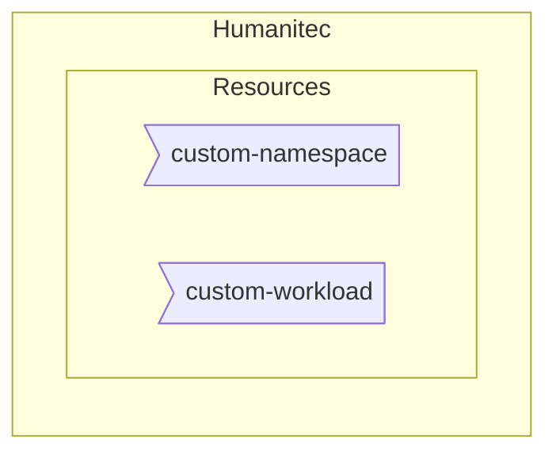

[_<< Previous section: Humanitec default setup_](/docs/humanitec-default.md)

## Common setup

- [(Platform admin) Create a custom `Namespace` resource definition](#platform-admin-create-a-custom-namespace-resource-definition)
- [(Platform admin) Create a custom Workload resource definition](#platform-admin-create-a-custom-workload-resource-definition)



```bash
HUMANITEC_ORG=FIXME
HUMANITEC_TOKEN=FIXME
```

### (Platform admin) Create a custom `Namespace` resource definition

Here we want to customize the name of the Kubernetes `Namespace` for all our Apps ([reference](https://docs.humanitec.com/guides/orchestrate-infrastructure/define-namespaces)).

```bash
cat <<EOF > custom-namespace.yaml
id: custom-namespace-test
name: custom-namespace-test
type: k8s-namespace
driver_type: humanitec/static
driver_inputs:
  values:
    namespace: \${context.env.id}-\${context.app.id}
criteria:
  - {}
EOF
yq -o json custom-namespace.yaml > custom-namespace.json
curl -X POST "https://api.humanitec.io/orgs/${HUMANITEC_ORG}/resources/defs" \
  	-H "Content-Type: application/json" \
	-H "Authorization: Bearer ${HUMANITEC_TOKEN}" \
  	-d @custom-namespace.json
```

### (Platform admin) Create a custom Workload resource definition

Here we want to customize the Kubernetes `Deployment` manifests for all our Workloads by adding the `securityContext` sections and other security features ([reference](https://docs.humanitec.com/integrations/resource-types/workload)).

```bash
cat <<EOF > custom-workload.yaml
id: custom-workload
name: custom-workload
type: workload
driver_type: humanitec/template
driver_inputs:
  values:
    templates:
      outputs: |
        update:
          - op: add
            path: /spec/automountServiceAccountToken
            value: false
	        - op: add
            path: /spec/serviceAccountName
            value: \${resources.k8s-service-account.outputs.name}
          - op: add
            path: /spec/securityContext
            value:
              seccompProfile:
                type: RuntimeDefault
              runAsNonRoot: true
              fsGroup: 1000
              runAsGroup: 1000
              runAsUser: 1000
          {{- range \$containerId, \$value := .resource.spec.containers }}
          - op: add
            path: /spec/containers/{{ \$containerId }}/securityContext
            value:
              privileged: false
              allowPrivilegeEscalation: false
              readOnlyRootFilesystem: true
              capabilities:
                drop:
                  - ALL
          {{- end }}
criteria:
  - {}
EOF
yq -o json custom-workload.yaml > custom-workload.json
curl -X POST "https://api.humanitec.io/orgs/${HUMANITEC_ORG}/resources/defs" \
  	-H "Content-Type: application/json" \
	-H "Authorization: Bearer ${HUMANITEC_TOKEN}" \
  	-d @custom-workload.json
```

[_Next section: GKE basic setup >>_](/docs/gke-basic.md)