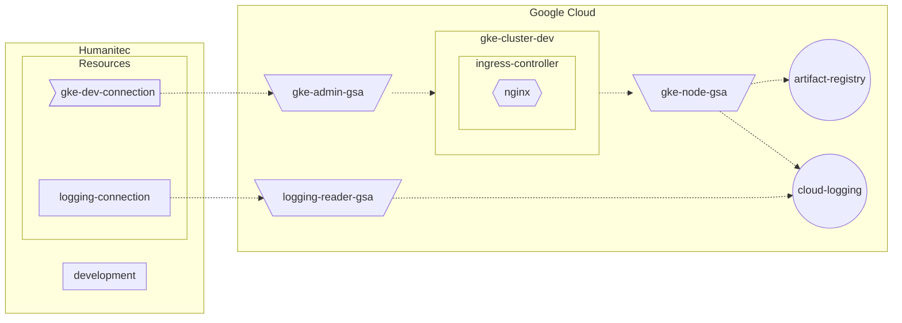

[_<< Previous section: GKE basic setup_](/docs/gke-basic.md)

# GKE advanced setup

**UNDER CONSTRUCTION, NOT READY YET... STAY TUNED!**

- [[PA-GCP] Create the GKE cluster](#pa-gcp-create-the-gke-cluster)



```bash
PROJECT_ID=FIXME
gcloud config set project ${PROJECT_ID}
CLUSTER_NAME=gke-advanced
REGION=northamerica-northeast1
ZONE=${REGION}-a
HUMANITEC_IP_ADDRESSES="34.159.97.57/32,35.198.74.96/32,34.141.77.162/32,34.89.188.214/32,34.159.140.35/32,34.89.165.141/32"
LOCAL_IP_ADRESS=$(curl ifconfig.co)

HUMANITEC_ORG=FIXME
HUMANITEC_TOKEN=FIXME

ENVIRONMENT=${CLUSTER_NAME}
```

## [PA-GCP] Create the GKE cluster

As Platform Admin, in Google Cloud.

```bash
gcloud services enable container.googleapis.com
```

Create a least privilege Google Service Account for the nodes of the GKE cluster:
```bash
gcloud services enable cloudresourcemanager.googleapis.com
GKE_NODE_SA_NAME=${CLUSTER_NAME}
GKE_NODE_SA_ID=${GKE_NODE_SA_NAME}@${PROJECT_ID}.iam.gserviceaccount.com
gcloud iam service-accounts create ${GKE_NODE_SA_NAME} \
    --display-name=${GKE_NODE_SA_NAME}
roles="roles/logging.logWriter roles/monitoring.metricWriter roles/monitoring.viewer"
for r in $roles; do gcloud projects add-iam-policy-binding ${PROJECT_ID} --member "serviceAccount:${GKE_NODE_SA_ID}" --role $r; done
```

Create an Artifact Registry repository in order to store the container images:
```bash
gcloud services enable artifactregistry.googleapis.com
gcloud services enable containeranalysis.googleapis.com
gcloud services enable containerscanning.googleapis.com
CONTAINERS_REGISTRY_NAME=containers
gcloud artifacts repositories create ${CONTAINERS_REGISTRY_NAME} \
    --location ${REGION} \
    --repository-format docker
gcloud artifacts repositories add-iam-policy-binding ${CONTAINERS_REGISTRY_NAME} \
    --location ${REGION} \
    --member "serviceAccount:${GKE_NODE_SA_ID}" \
    --role roles/artifactregistry.reader
```

Create the GKE cluster with advanced and secure features (like Workload Identity, Network Policies, Confidential nodes, private nodes)
```bash
gcloud container clusters create ${CLUSTER_NAME} \
    --zone ${ZONE} \
    --scopes cloud-platform \
    --workload-pool=${PROJECT_ID}.svc.id.goog \
    --enable-master-authorized-networks \
    --master-authorized-networks ${HUMANITEC_IP_ADDRESSES},${LOCAL_IP_ADRESS}/32 \
    --no-enable-google-cloud-access \
    --enable-ip-alias \
    --enable-private-nodes \
    --master-ipv4-cidr 172.16.0.32/28 \
    --service-account ${GKE_NODE_SA_ID} \
    --machine-type n2d-standard-4 \
    --enable-confidential-nodes \
    --release-channel rapid \
    --enable-dataplane-v2 \
    --enable-shielded-nodes \
    --shielded-integrity-monitoring \
    --shielded-secure-boot
```

Create a Cloud NAT router in order to access the public internet in egress from the GKE cluster:
```bash
gcloud compute routers create ${CLUSTER_NAME} \
    --network default \
    --region ${REGION}
gcloud compute routers nats create ${CLUSTER_NAME} \
    --router-region ${REGION} \
    --router ${CLUSTER_NAME} \
    --nat-all-subnet-ip-ranges \
    --auto-allocate-nat-external-ips
```

## Ingress controller

Deploy the Ingress Controller:
```bash
helm upgrade \
    --install ingress-nginx ingress-nginx \
    --repo https://kubernetes.github.io/ingress-nginx \
    --namespace ingress-nginx \
    --create-namespace
```

Let’s grab the Public IP address of that Ingress Controller:
```bash
INGRESS_IP=$(kubectl get svc ingress-nginx-controller \
    -n ingress-nginx \
    -o jsonpath="{.status.loadBalancer.ingress[*].ip}")
```

## GSA to access GKE

```bash
GKE_ADMIN_SA_NAME=humanitec-gke-dev
GKE_ADMIN_SA_ID=${GKE_ADMIN_SA_NAME}@${PROJECT_ID}.iam.gserviceaccount.com
gcloud iam service-accounts create ${GKE_ADMIN_SA_NAME} \
	--display-name=${GKE_ADMIN_SA_NAME}
gcloud projects add-iam-policy-binding ${PROJECT_ID} \
	--member "serviceAccount:${GKE_ADMIN_SA_ID}" \
	--role "roles/container.admin"
```

Let’s download locally the GSA key:
```bash
gcloud iam service-accounts keys create ${GKE_ADMIN_SA_NAME}.json \
    --iam-account ${GKE_ADMIN_SA_ID}
```

## Create the GKE connection in Humanitec

```bash
HUMANITEC_ORG=FIXME
HUMANITEC_TOKEN=FIXME
curl "https://api.humanitec.io/orgs/${HUMANITEC_ORG}/resources/defs" \
  -X POST \
  -H "Authorization: Bearer ${HUMANITEC_TOKEN}" \
  -H "Content-Type: application/json" \
  --data-binary "
{
  "id": "my-cluster",
  "name": "My Cluster",
  "type": "k8s-cluster",
  "criteria": [
    {
      "env_type": "development"
    }
  ],
  "driver_type": "humanitec/k8s-cluster-gke",
  "driver_inputs": {
    "values": {
      "loadbalancer": ${INGRESS_IP}
      "name": ${CLUSTER_NAME}
      "project_id":${PROJECT_ID}
      "zone": ${ZONE}
    },
    "secrets": {
      "credentials": $(cat ${GKE_ADMIN_SA_NAME}.json)
    }
  }
}"
```

Remove the local GSA's key:
```bash
rm ${GKE_ADMIN_SA_NAME}.json
```

### GSA to access Cloud Logging

```bash
LOGGING_READER_SA_NAME=humanitec-logging-dev
LOGGING_READER_SA_ID=${LOGGING_READER_SA_NAME}@${PROJECT_ID}.iam.gserviceaccount.com
gcloud iam service-accounts create ${LOGGING_READER_SA_NAME} \
	--display-name=${LOGGING_READER_SA_NAME}
gcloud projects add-iam-policy-binding ${PROJECT_ID} \
	--member "serviceAccount:${LOGGING_READER_SA_ID}" \
	--role "roles/logging.viewer"
```

Let’s download locally the GSA key:
```bash
gcloud iam service-accounts keys create ${LOGGING_READER_SA_NAME}.json \
    --iam-account ${LOGGING_READER_SA_ID}
```

### Custom Service Account resource definition

```bash
cat <<EOF > custom-sa.yaml
id: custom-sa
name: custom-sa
type: k8s-service-account
driver_type: humanitec/template
driver_inputs:
  values:
    templates:
      init: |
        name: {{ index (regexSplit "\\." "$${context.res.id}" -1) 1 }}
      manifests: |
        service-account.yaml:
          location: namespace
          data:
            apiVersion: v1
            kind: ServiceAccount
            metadata:
              {{if eq .init.name "cartservice" }}
              annotations:
                iam.gke.io/gcp-service-account: spanner-db-user-sa@mathieu-benoit-gcp.iam.gserviceaccount.com
              {{end}}
              name: {{ .init.name }}
      outputs: |
        name: {{ .init.name }}
criteria:
  - {}
EOF
yq -o json custom-sa.yaml > custom-sa.json
curl "https://api.humanitec.io/orgs/${HUMANITEC_ORG}/resources/defs" \
    -X POST \
  	-H "Content-Type: application/json" \
	  -H "Authorization: Bearer ${HUMANITEC_TOKEN}" \
  	-d @custom-sa.json
```