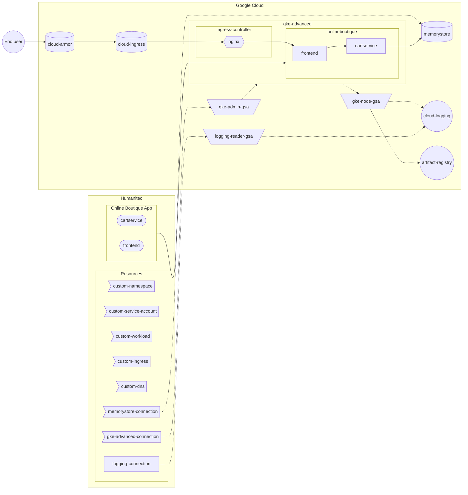

[_<< Previous section: GKE basic setup_](/docs/gke-basic.md)

# GKE advanced setup

- [[PA-GCP] Create the GKE cluster](#pa-gcp-create-the-gke-cluster)
- [[PA-GCP] Deploy the Nginx Ingress controller](#pa-gcp-deploy-the-nginx-ingress-controller)
- [[PA-GCP] Protect the Nginx Ingress controller behind a Global Cloud Load Balancer (GCLB) and Cloud Armor (WAF)](#pa-gcp-protect-the-nginx-ingress-controller-behind-a-global-cloud-load-balancer-gclb-and-cloud-armor-waf)
- [[PA-HUM] Create the associated DNS and TLS resource definitions](#pa-hum-create-the-associated-dns-and-tls-resource-definitions)
- [[PA-GCP] Create the Google Service Account to access the GKE cluster](#pa-gcp-create-the-google-service-account-to-access-the-gke-cluster)
- [[PA-HUM] Create the GKE access resource definition](#pa-hum-create-the-gke-access-resource-definition)
- [[PA-GCP] Create the Google Service Account to access Cloud Logging](#pa-gcp-create-the-google-service-account-to-access-cloud-logging)
- [[PA-HUM] Create the `gke-advanced` Environment](#pa-hum-create-the-gke-advanced-environment)
- _More to come, stay tuned!_



```bash
PROJECT_ID=FIXME
gcloud config set project ${PROJECT_ID}
CLUSTER_NAME=gke-advanced
REGION=northamerica-northeast1
ZONE=${REGION}-a
NETWORK=default
HUMANITEC_IP_ADDRESSES="34.159.97.57/32,35.198.74.96/32,34.141.77.162/32,34.89.188.214/32,34.159.140.35/32,34.89.165.141/32"
LOCAL_IP_ADRESS=$(curl -s ifconfig.co)

HUMANITEC_ORG=FIXME
HUMANITEC_TOKEN=FIXME

ENVIRONMENT=${CLUSTER_NAME}
```

## [PA-GCP] Create the GKE cluster

As Platform Admin, in Google Cloud.

```bash
gcloud services enable container.googleapis.com
```

Create a least privilege Google Service Account for the nodes of the GKE cluster:
```bash
gcloud services enable cloudresourcemanager.googleapis.com
GKE_NODE_SA_NAME=${CLUSTER_NAME}
GKE_NODE_SA_ID=${GKE_NODE_SA_NAME}@${PROJECT_ID}.iam.gserviceaccount.com
gcloud iam service-accounts create ${GKE_NODE_SA_NAME} \
    --display-name=${GKE_NODE_SA_NAME}
roles="roles/logging.logWriter roles/monitoring.metricWriter roles/monitoring.viewer"
for r in $roles; do gcloud projects add-iam-policy-binding ${PROJECT_ID} --member "serviceAccount:${GKE_NODE_SA_ID}" --role $r; done
```

Create an Artifact Registry repository in order to store the container images:
```bash
gcloud services enable artifactregistry.googleapis.com
gcloud services enable containeranalysis.googleapis.com
gcloud services enable containerscanning.googleapis.com
CONTAINERS_REGISTRY_NAME=containers
gcloud artifacts repositories create ${CONTAINERS_REGISTRY_NAME} \
    --location ${REGION} \
    --repository-format docker
gcloud artifacts repositories add-iam-policy-binding ${CONTAINERS_REGISTRY_NAME} \
    --location ${REGION} \
    --member "serviceAccount:${GKE_NODE_SA_ID}" \
    --role roles/artifactregistry.reader
```

Create the GKE cluster with advanced and secure features (like Workload Identity, Network Policies, Confidential nodes, private nodes)
```bash
CLUSTER_FIREWALL_RULE_TAG=${CLUSTER_NAME}-nodes
CLUSTER_MASTER_IP_CIDR=172.16.0.32/28
gcloud container clusters create ${CLUSTER_NAME} \
    --zone ${ZONE} \
    --scopes cloud-platform \
    --workload-pool=${PROJECT_ID}.svc.id.goog \
    --enable-master-authorized-networks \
    --master-authorized-networks ${HUMANITEC_IP_ADDRESSES},${LOCAL_IP_ADRESS}/32 \
    --no-enable-google-cloud-access \
    --enable-ip-alias \
    --enable-private-nodes \
    --master-ipv4-cidr ${CLUSTER_MASTER_IP_CIDR} \
    --tags ${CLUSTER_FIREWALL_RULE_TAG} \
    --network ${NETWORK} \
    --service-account ${GKE_NODE_SA_ID} \
    --machine-type n2d-standard-4 \
    --enable-confidential-nodes \
    --release-channel rapid \
    --enable-dataplane-v2 \
    --enable-shielded-nodes \
    --shielded-integrity-monitoring \
    --shielded-secure-boot
```

Create a Cloud NAT router in order to access the public internet in egress from the GKE cluster:
```bash
gcloud compute routers create ${CLUSTER_NAME} \
    --network ${NETWORK} \
    --region ${REGION}
gcloud compute routers nats create ${CLUSTER_NAME} \
    --router-region ${REGION} \
    --router ${CLUSTER_NAME} \
    --nat-all-subnet-ip-ranges \
    --auto-allocate-nat-external-ips
```

## [PA-GCP] Deploy the Nginx Ingress controller

As Platform Admin, in Google Cloud.

Deploy the Nginx Ingress Controller:
```bash
NGINX_NEG_PORT=80
NGINX_NEG_NAME=${CLUSTER_NAME}-ingress-nginx-${NGINX_NEG_PORT}-neg
cat <<EOF > ${CLUSTER_NAME}-nginx-ingress-controller-values.yaml
controller:
  service:
    type: ClusterIP
    annotations:
      cloud.google.com/neg: '{"exposed_ports": {"${NGINX_NEG_PORT}":{"name": "${NGINX_NEG_NAME}"}}}'
EOF
helm upgrade \
    --install ingress-nginx ingress-nginx \
    --repo https://kubernetes.github.io/ingress-nginx \
    --namespace ingress-nginx \
    --create-namespace \
    -f ${CLUSTER_NAME}-nginx-ingress-controller-values.yaml
```

Allow Kubernetes master nodes to talk to the node pool on port `8443` for Nginx Ingress controller:
```bash
gcloud compute firewall-rules create k8s-masters-to-nodes-on-8443 \
    --network ${NETWORK} \
    --direction INGRESS \
    --source-ranges ${CLUSTER_MASTER_IP_CIDR} \
    --target-tags ${CLUSTER_FIREWALL_RULE_TAG} \
    --allow tcp:8443
```

## [PA-GCP] Protect the Nginx Ingress controller behind a Global Cloud Load Balancer (GCLB) and Cloud Armor (WAF)

Allow traffic from the Global Loab Balancer (GCLB) to the node pool on port `80` for Nginx Ingress controller:
```bash
gcloud compute firewall-rules create ${CLUSTER_NAME}-allow-tcp-loadbalancer \
    --network ${NETWORK} \
    --allow tcp:${NGINX_NEG_PORT} \
	  --source-ranges 130.211.0.0/22,35.191.0.0/16 \
	  --target-tags ${CLUSTER_FIREWALL_RULE_TAG}
```

```bash
gcloud compute health-checks create http ${CLUSTER_NAME}-ingress-nginx-health-check \
    --port ${NGINX_NEG_PORT} \
    --check-interval 60 \
    --unhealthy-threshold 3 \
    --healthy-threshold 1 \
    --timeout 5 \
    --request-path /healthz

gcloud compute backend-services create ${CLUSTER_NAME}-ingress-nginx-backend-service \
    --load-balancing-scheme EXTERNAL_MANAGED \
    --protocol HTTP \
    --port-name http \
    --health-checks ${CLUSTER_NAME}-ingress-nginx-health-check \
    --enable-logging \
    --global

gcloud compute backend-services add-backend ${CLUSTER_NAME}-ingress-nginx-backend-service \
    --network-endpoint-group ${NGINX_NEG_NAME} \
    --network-endpoint-group-zone ${ZONE} \
    --balancing-mode RATE \
    --capacity-scaler 1.0 \
    --max-rate-per-endpoint 100 \
    --global

gcloud compute url-maps create ${CLUSTER_NAME}-ingress-nginx-loadbalancer \
    --default-service ${CLUSTER_NAME}-ingress-nginx-backend-service

gcloud compute target-http-proxies create ${CLUSTER_NAME}-ingress-nginx-http-proxy \
    --url-map ${CLUSTER_NAME}-ingress-nginx-loadbalancer
```

```bash
gcloud compute addresses create ${CLUSTER_NAME}-public-static-ip \
    --global
INGRESS_IP=$(gcloud compute addresses describe ${CLUSTER_NAME}-public-static-ip --global --format "value(address)")
echo ${INGRESS_IP}
```

```bash
ONLINEBOUTIQUE_DNS=FIXME
openssl genrsa -out ${CLUSTER_NAME}-${ONLINEBOUTIQUE_APP}-ca.key 2048
openssl req -x509 \
    -new \
    -nodes \
    -days 365 \
    -key ${CLUSTER_NAME}-${ONLINEBOUTIQUE_APP}-ca.key \
    -out ${CLUSTER_NAME}-${ONLINEBOUTIQUE_APP}-ca.crt \
    -subj "/CN=${ONLINEBOUTIQUE_DNS}"
```

```bash
gcloud compute ssl-certificates create ${CLUSTER_NAME}-${ONLINEBOUTIQUE_APP}-ssl-certificate \
    --certificate ${CLUSTER_NAME}-${ONLINEBOUTIQUE_APP}-ca.crt \
    --private-key ${CLUSTER_NAME}-${ONLINEBOUTIQUE_APP}-ca.key \
    --global
gcloud compute target-https-proxies create ${CLUSTER_NAME}-ingress-nginx-http-proxy \
    --url-map ${CLUSTER_NAME}-ingress-nginx-loadbalancer \
    --ssl-certificates ${CLUSTER_NAME}-${ONLINEBOUTIQUE_APP}-ssl-certificate
```

```bash
gcloud compute forwarding-rules create ${CLUSTER_NAME}-https-forwarding-rule \
    --load-balancing-scheme EXTERNAL_MANAGED \
    --network-tier PREMIUM \
    --global \
    --ports 443 \
    --target-https-proxy ${CLUSTER_NAME}-ingress-nginx-http-proxy \
    --address ${CLUSTER_NAME}-public-static-ip
```

```bash
cat <<EOF > ${CLUSTER_NAME}-http-to-https-redirect.yaml
kind: compute#urlMap
name: ${CLUSTER_NAME}-http-to-https-redirect
defaultUrlRedirect:
  redirectResponseCode: MOVED_PERMANENTLY_DEFAULT
  httpsRedirect: True
EOF
gcloud compute url-maps import ${CLUSTER_NAME}-http-to-https-redirect \
    --source ${CLUSTER_NAME}-http-to-https-redirect.yaml \
    --global
gcloud compute target-http-proxies create ${CLUSTER_NAME}-http-to-https-redirect-proxy \
    --url-map ${CLUSTER_NAME}-http-to-https-redirect \
    --global
gcloud compute forwarding-rules create ${CLUSTER_NAME}-http-to-https-redirect-rule \
    --load-balancing-scheme EXTERNAL_MANAGED \
    --network-tier PREMIUM \
    --address ${CLUSTER_NAME}-public-static-ip \
    --global \
    --target-http-proxy ${CLUSTER_NAME}-http-to-https-redirect-proxy \
    --ports 80
```

Create Cloud Armor (DDoS protection only) and attach it to the public endpoint:
```bash
gcloud compute security-policies create ${CLUSTER_NAME}-security-policy
gcloud compute security-policies update ${CLUSTER_NAME}-security-policy \
    --enable-layer7-ddos-defense
gcloud compute backend-services update ${CLUSTER_NAME}-ingress-nginx-backend-service \
    --global \
    --security-policy ${CLUSTER_NAME}-security-policy
```

## [PA-HUM] Create the associated DNS and TLS resource definitions

As Platform Admin, in Humanitec.

Create the custom Ingress resource definition:
```bash
cat <<EOF > custom-ingress.yaml
id: custom-ingress
name: custom-ingress
type: ingress
driver_type: humanitec/ingress
driver_inputs:
  values:
    api_version: v1
    class: nginx
    no_tls: true
criteria:
  - env_id: ${ENVIRONMENT}
EOF
yq -o json custom-ingress.yaml > custom-ingress.json
curl "https://api.humanitec.io/orgs/${HUMANITEC_ORG}/resources/defs" \
    -X POST \
    -H "Content-Type: application/json" \
    -H "Authorization: Bearer ${HUMANITEC_TOKEN}" \
    -d @custom-ingress.json
```

Create the custom DNS resource definition:
```bash
cat <<EOF > ${CLUSTER_NAME}-${ONLINEBOUTIQUE_APP}-dns.yaml
id: ${CLUSTER_NAME}-${ONLINEBOUTIQUE_APP}-dns
name: ${CLUSTER_NAME}-${ONLINEBOUTIQUE_APP}-dns
type: dns
driver_type: humanitec/static
driver_inputs:
  values:
    host: ${ONLINEBOUTIQUE_DNS}
criteria:
  - env_id: ${ENVIRONMENT}
    app_id: ${ONLINEBOUTIQUE_APP}
EOF
yq -o json ${CLUSTER_NAME}-${ONLINEBOUTIQUE_APP}-dns.yaml > ${CLUSTER_NAME}-${ONLINEBOUTIQUE_APP}-dns.json
curl "https://api.humanitec.io/orgs/${HUMANITEC_ORG}/resources/defs" \
    -X POST \
    -H "Content-Type: application/json" \
    -H "Authorization: Bearer ${HUMANITEC_TOKEN}" \
    -d @${CLUSTER_NAME}-${ONLINEBOUTIQUE_APP}-dns.json
```

## [PA-GCP] Create the Google Service Account to access the GKE cluster

As Platform Admin, in Google Cloud.

Create the Google Service Account (GSA) with the appropriate role:
```bash
GKE_ADMIN_SA_NAME=humanitec-to-${CLUSTER_NAME}
GKE_ADMIN_SA_ID=${GKE_ADMIN_SA_NAME}@${PROJECT_ID}.iam.gserviceaccount.com
gcloud iam service-accounts create ${GKE_ADMIN_SA_NAME} \
    --display-name=${GKE_ADMIN_SA_NAME}
gcloud projects add-iam-policy-binding ${PROJECT_ID} \
    --member "serviceAccount:${GKE_ADMIN_SA_ID}" \
    --role "roles/container.admin"
```
_Note: for future considerations, add a condition to access only this specific GKE cluster, not all._

Download locally the GSA key:
```bash
gcloud iam service-accounts keys create ${GKE_ADMIN_SA_NAME}.json \
    --iam-account ${GKE_ADMIN_SA_ID}
```

## [PA-HUM] Create the GKE access resource definition

As Platform Admin, in Humanitec.

Create the GKE access resource definition:
```bash
cat <<EOF > ${CLUSTER_NAME}.yaml
id: ${CLUSTER_NAME}
name: ${CLUSTER_NAME}
type: k8s-cluster
driver_type: humanitec/k8s-cluster-gke
driver_inputs:
  values:
    loadbalancer: ${INGRESS_IP}
    name: ${CLUSTER_NAME}
    project_id: ${PROJECT_ID}
    zone: ${ZONE}
  secrets:
    credentials: $(cat ${GKE_ADMIN_SA_NAME}.json)
criteria:
  - env_id: ${ENVIRONMENT}
EOF
yq -o json ${CLUSTER_NAME}.yaml > ${CLUSTER_NAME}.json
curl "https://api.humanitec.io/orgs/${HUMANITEC_ORG}/resources/defs" \
    -X POST \
    -H "Content-Type: application/json" \
    -H "Authorization: Bearer ${HUMANITEC_TOKEN}" \
    -d @${CLUSTER_NAME}.json
```

Clean sensitive information locally:
```bash
rm ${GKE_ADMIN_SA_NAME}.json
rm ${CLUSTER_NAME}.yaml
rm ${CLUSTER_NAME}.json
```

## [PA-GCP] Create the Google Service Account to access Cloud Logging

As Platform Admin, in Google Cloud.

Create the Google Service Account (GSA) with the appropriate role:
```bash
LOGGING_READER_SA_NAME=humanitec-to-${CLUSTER_NAME}-logs
LOGGING_READER_SA_ID=${LOGGING_READER_SA_NAME}@${PROJECT_ID}.iam.gserviceaccount.com
gcloud iam service-accounts create ${LOGGING_READER_SA_NAME} \
    --display-name=${LOGGING_READER_SA_NAME}
gcloud projects add-iam-policy-binding ${PROJECT_ID} \
    --member "serviceAccount:${LOGGING_READER_SA_ID}" \
    --role "roles/logging.viewer"
```

Download locally the GSA key:
```bash
gcloud iam service-accounts keys create ${LOGGING_READER_SA_NAME}.json \
    --iam-account ${LOGGING_READER_SA_ID}
```

## [PA-HUM] Create the Cloud Logging access resource definition

As Platform Admin, in Humanitec.

Create the Cloud Logging access resource definition:
```bash
cat <<EOF > ${CLUSTER_NAME}-logging.yaml
id: ${CLUSTER_NAME}-logging
name: ${CLUSTER_NAME}-logging
type: logging
driver_type: humanitec/logging-gcp
driver_inputs:
  values:
    cluster_name: ${CLUSTER_NAME}
    cluster_zone: ${ZONE}
    project_id: ${PROJECT_ID}
  secrets:
    credentials: $(cat ${LOGGING_READER_SA_NAME}.json)
criteria:
  - env_id: ${ENVIRONMENT}
EOF
yq -o json ${CLUSTER_NAME}-logging.yaml > ${CLUSTER_NAME}-logging.json
curl "https://api.humanitec.io/orgs/${HUMANITEC_ORG}/resources/defs" \
    -X POST \
    -H "Content-Type: application/json" \
    -H "Authorization: Bearer ${HUMANITEC_TOKEN}" \
    -d @${CLUSTER_NAME}-logging.json
```

Clean sensitive information locally:
```bash
rm ${LOGGING_READER_SA_NAME}.json
rm ${CLUSTER_NAME}-logging.yaml
rm ${CLUSTER_NAME}-logging.json
```

## [PA-HUM] Create the `gke-advanced` Environment

As Platform Admin, in Humanitec.

Get the latest Deployment's id of the existing Environment:
```bash
CLONED_ENVIRONMENT=development
LAST_DEPLOYMENT_IN_CLONED_ENVIRONMENT=$(curl "https://api.humanitec.io/orgs/${HUMANITEC_ORG}/apps/${ONLINEBOUTIQUE_APP}/envs/${CLONED_ENVIRONMENT}/deploys" \
    -s \
    -H "Authorization: Bearer ${HUMANITEC_TOKEN}" \
    -H "Content-Type: application/json" \
    | jq -r .[0].id)
```

Create the new Environment by cloning the existing Environment from its latest Deployment:
```bash
cat <<EOF > ${ONLINEBOUTIQUE_APP}-${ENVIRONMENT}-env.yaml
from_deploy_id: ${LAST_DEPLOYMENT_IN_CLONED_ENVIRONMENT}
id: ${ENVIRONMENT}
name: ${ENVIRONMENT}
type: development
EOF
yq -o json ${ONLINEBOUTIQUE_APP}-${ENVIRONMENT}-env.yaml > ${ONLINEBOUTIQUE_APP}-${ENVIRONMENT}-env.json
curl "https://api.humanitec.io/orgs/${HUMANITEC_ORG}/apps/${ONLINEBOUTIQUE_APP}/envs" \
    -X POST \
    -H "Content-Type: application/json" \
    -H "Authorization: Bearer ${HUMANITEC_TOKEN}" \
    -d @${ONLINEBOUTIQUE_APP}-${ENVIRONMENT}-env.json
```

Get the current Delta in draft mode in the newly created Environment:
```bash
DRAFT_DELTA_IN_NEW_ENVIRONMENT=$(curl "https://api.humanitec.io/orgs/${HUMANITEC_ORG}/apps/${ONLINEBOUTIQUE_APP}/deltas?env=${ENVIRONMENT}" \
    -s \
    -H "Authorization: Bearer ${HUMANITEC_TOKEN}" \
    -H "Content-Type: application/json" \
    | jq -r .[0].id)
echo ${DRAFT_DELTA_IN_NEW_ENVIRONMENT}
```
_Note: re-run the above commands until you get a value for `DRAFT_DELTA_IN_NEW_ENVIRONMENT`._

Deploy current Delta in draft mode:
```bash
curl https://api.humanitec.io/orgs/${HUMANITEC_ORG}/apps/${ONLINEBOUTIQUE_APP}/envs/${ENVIRONMENT}/deploys \
    -X POST \
    -H "Authorization: Bearer ${HUMANITEC_TOKEN}" \
    -H "Content-Type: application/json" \
    -d @- <<EOF
{
  "comment": "Deploy App based on cloned Environment.",
  "delta_id": "${DRAFT_DELTA_IN_NEW_ENVIRONMENT}"
}
EOF
```

Get the public DNS exposing the `frontend` Workload:
```bash
curl "https://api.humanitec.io/orgs/${HUMANITEC_ORG}/apps/${ONLINEBOUTIQUE_APP}/envs/${ENVIRONMENT}/resources" \
    -s \
    -H "Authorization: Bearer ${HUMANITEC_TOKEN}" \
    -H "Content-Type: application/json" \
    | jq -c '.[] | select(.type | contains("dns"))' \
    | jq -r .resource.host
```
_Note: re-run the above command until you get a value._

**BELOW IS UNDER CONSTRUCTION, NOT READY YET... STAY TUNED!**

### Custom Service Account resource definition

```bash
cat <<EOF > custom-sa.yaml
id: custom-sa
name: custom-sa
type: k8s-service-account
driver_type: humanitec/template
driver_inputs:
  values:
    templates:
      init: |
        name: {{ index (regexSplit "\\." "$${context.res.id}" -1) 1 }}
      manifests: |
        service-account.yaml:
          location: namespace
          data:
            apiVersion: v1
            kind: ServiceAccount
            metadata:
              {{if eq .init.name "cartservice" }}
              annotations:
                iam.gke.io/gcp-service-account: spanner-db-user-sa@mathieu-benoit-gcp.iam.gserviceaccount.com
              {{end}}
              name: {{ .init.name }}
      outputs: |
        name: {{ .init.name }}
criteria:
  - {}
EOF
yq -o json custom-sa.yaml > custom-sa.json
curl "https://api.humanitec.io/orgs/${HUMANITEC_ORG}/resources/defs" \
    -X POST \
  	-H "Content-Type: application/json" \
	  -H "Authorization: Bearer ${HUMANITEC_TOKEN}" \
  	-d @custom-sa.json
```