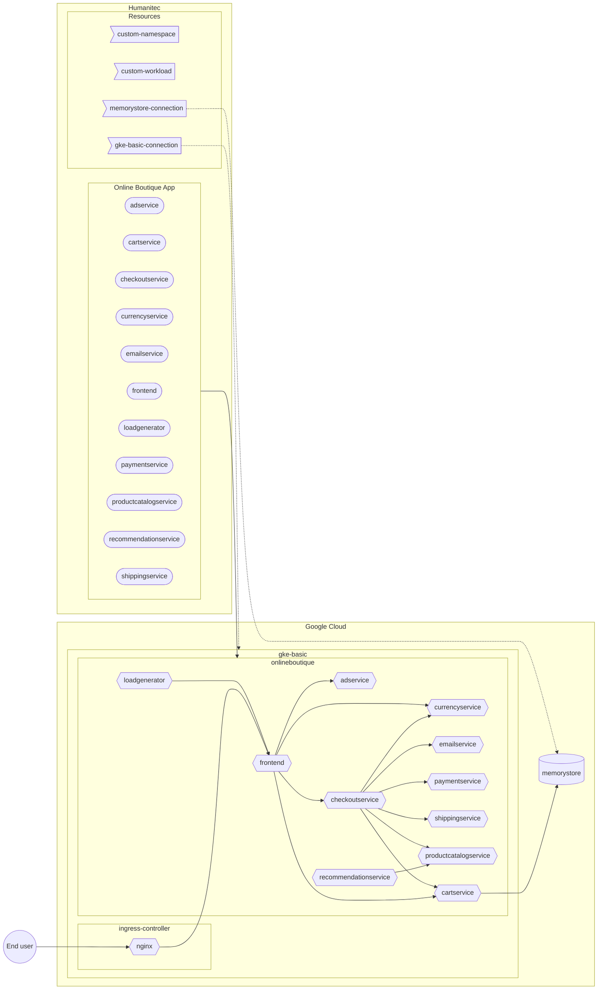

[_<< Previous section: Common setup_](/docs/common.md)

# GKE basic setup

- [(Platform admin) Create the GKE cluster in Google Cloud](#platform-admin-create-the-gke-cluster-in-google-cloud)
- [(Platform admin) Deploy the Nginx Ingress controller in the GKE cluster](#platform-admin-deploy-the-nginx-ingress-controller-in-the-gke-cluster)
- [(Platform admin) Create the Google Service Account to access the GKE cluster from Humanitec to in Google Cloud](#platform-admin-create-the-google-service-account-to-access-the-gke-cluster-from-humanitec-to-in-google-cloud)
- [(Platform admin) Create the GKE access resource definition in Humanitec](#platform-admin-create-the-gke-access-resource-definition-in-humanitec)
- [(Platform admin) Create the `gke-basic` Environment in Humanitec](#platform-admin-create-the-gke-basic-environment-in-humanitec)
- [(Developer) Deploy the Online Boutique Workloads (with in-cluster `redis`) in `gke-basic` Environment](#developer-deploy-the-online-boutique-workloads-with-in-cluster-redis-in-gke-basic-environment)
- [(Platform admin) Create a Memorystore (Redis) database](#platform-admin-create-a-memorystore-redis-database)
- [(Platform admin) Create the Memorystore (Redis) access resource definition in Humanitec](#platform-admin-create-the-memorystore-redis-access-resource-definition-in-humanitec)
- [(Developer) Deploy the `cartservice` Workload with Memorystore (Redis) in `gke-basic` Environment](#developer-deploy-the-cartservice-workload-with-memorystore-redis-in-gke-basic-environment)



```bash
PROJECT_ID=FIXME
gcloud config set project ${PROJECT_ID}
CLUSTER_NAME=gke-basic
REGION=northamerica-northeast1
ZONE=${REGION}-a
HUMANITEC_IP_ADDRESSES="34.159.97.57/32,35.198.74.96/32,34.141.77.162/32,34.89.188.214/32,34.159.140.35/32,34.89.165.141/32"

HUMANITEC_ORG=FIXME
HUMANITEC_TOKEN=FIXME

ENVIRONMENT=${CLUSTER_NAME}
```

## (Platform admin) Create the GKE cluster in Google Cloud

```bash
gcloud services enable container.googleapis.com
```

```bash
gcloud container clusters create ${CLUSTER_NAME} \
    --zone ${ZONE} \
    --scopes cloud-platform \
    --workload-pool=${PROJECT_ID}.svc.id.goog \
    --enable-master-authorized-networks \
    --master-authorized-networks ${HUMANITEC_IP_ADDRESSES} \
    --no-enable-google-cloud-access
```
_Note: here we are restricting the access to the public Kubernetes server API only by Humanitec. If you want to access this cluster from your local machine, you need to add your own IP address here too._

## (Platform admin) Deploy the Nginx Ingress controller in the GKE cluster

Deploy the Nginx Ingress Controller:
```bash
NGING_INGRESS_CONTROLLER_VERSION=1.7.0
kubectl apply \
    -f https://raw.githubusercontent.com/kubernetes/ingress-nginx/controller-v${NGING_INGRESS_CONTROLLER_VERSION}/deploy/static/provider/cloud/deploy.yaml
```

Grab the Public IP address of that Ingress Controller:
```bash
INGRESS_IP=$(kubectl get svc ingress-nginx-controller \
    -n ingress-nginx \
    -o jsonpath="{.status.loadBalancer.ingress[*].ip}")
```

## (Platform admin) Create the Google Service Account to access the GKE cluster from Humanitec to in Google Cloud

Create the Google Service Account (GSA) with the appropriate role:
```bash
GKE_ADMIN_SA_NAME=humanitec-access-to-${CLUSTER_NAME}
GKE_ADMIN_SA_ID=${SA_NAME}@${PROJECT_ID}.iam.gserviceaccount.com
gcloud iam service-accounts create ${GKE_ADMIN_SA_NAME} \
	--display-name=${GKE_ADMIN_SA_NAME}
gcloud projects add-iam-policy-binding ${PROJECT_ID} \
	--member "serviceAccount:${GKE_ADMIN_SA_ID}" \
	--role "roles/container.admin"
```

Download locally the GSA key:
```bash
gcloud iam service-accounts keys create ${GKE_ADMIN_SA_NAME}.json \
    --iam-account ${GKE_ADMIN_SA_ID}
```

## (Platform admin) Create the GKE access resource definition in Humanitec

```bash
curl https://api.humanitec.io/orgs/${HUMANITEC_ORG}/resources/defs \
  -X POST \
  -H "Authorization: Bearer ${HUMANITEC_TOKEN}" \
  -H "Content-Type: application/json" \
  --data-binary "
{
  "id": "${CLUSTER_NAME}",
  "name": "${CLUSTER_NAME}",
  "type": "k8s-cluster",
  "criteria": [
    {
      "env_id": "${ENVIRONMENT}"
    }
  ],
  "driver_type": "humanitec/k8s-cluster-gke",
  "driver_inputs": {
    "values": {
      "loadbalancer": ${INGRESS_IP}
      "name": ${CLUSTER_NAME}
      "project_id":${PROJECT_ID}
      "zone": ${ZONE}
    },
    "secrets": {
      "credentials": $(cat ${GKE_ADMIN_SA_NAME}.json)
    }
  }
}"
```

Remove the local GSA's key:
```bash
rm ${GKE_ADMIN_SA_NAME}.json
```

## (Platform admin) Create the `gke-basic` Environment in Humanitec

FIXME

## (Developer) Deploy the Online Boutique Workloads (with in-cluster `redis`) in `gke-basic` Environment in Humanitec

```bash
FIRST_WORKLOAD="adservice"
COMBINED_DELTA=$(score-humanitec delta --app ${ONLINEBOUTIQUE_APP} --env ${ENVIRONMENT} --org ${HUMANITEC_ORG} --token ${HUMANITEC_TOKEN} --retry -f ${FIRST_WORKLOAD}/score.yaml --extensions ${FIRST_WORKLOAD}/humanitec.score.yaml | jq -r .id)
WORKLOADS="cartservice checkoutservice currencyservice emailservice frontend loadgenerator paymentservice productcatalogservice recommendationservice redis"
for w in ${WORKLOADS}; do COMBINED_DELTA=$(score-humanitec delta --app ${ONLINEBOUTIQUE_APP} --env ${ENVIRONMENT} --org ${HUMANITEC_ORG} --token ${HUMANITEC_TOKEN} --delta ${COMBINED_DELTA} --retry -f $w/score.yaml --extensions $w/humanitec.score.yaml | jq -r .id); done
LAST_WORKLOAD="shippingservice"
score-humanitec delta \
	--app ${ONLINEBOUTIQUE_APP} \
	--env ${ENVIRONMENT} \
	--org ${HUMANITEC_ORG} \
	--token ${HUMANITEC_TOKEN} \
	--deploy \
	--delta ${COMBINED_DELTA} \
	--retry \
	-f ${LAST_WORKLOAD}/score.yaml \
	--extensions ${LAST_WORKLOAD}/humanitec.score.yaml
```
_Note: `loadgenerator` is deployed to generate both: traffic on these apps and data in the database. If you don't want this, feel free to remove it from the above list of `WORKLOADS`._

Get the public DNS exposing the `frontend` Workload:
```bash
curl -s https://api.humanitec.io/orgs/${HUMANITEC_ORG}/apps/${ONLINEBOUTIQUE_APP}/envs/${ENVIRONMENT}/resources \
	-H "Authorization: Bearer ${HUMANITEC_TOKEN}" \
	-H "Content-Type: application/json" \
	| jq -c '.[] | select(.type | contains("dns"))' \
	| jq -r .resource.host
```

## (Platform admin) Create a Memorystore (Redis) database in Google Cloud

```bash
gcloud services enable redis.googleapis.com

REDIS_NAME=redis-cart
gcloud redis instances create ${REDIS_NAME} \
    --size 1 \
    --region ${REGION} \
    --zone ${ZONE} \
    --redis-version redis_6_x \
    --enable-auth
```

```bash
gcloud redis instances describe ${REDIS_NAME} \
   --region ${REGION} \
   --format 'get(host)'

gcloud redis instances describe ${REDIS_NAME} \
   --region ${REGION} \
   --format 'get(port)'

gcloud redis instances get-auth-string ${REDIS_NAME} \
   --region ${REGION}
```

## (Platform admin) Create the Memorystore (Redis) access resource definition in Humanitec

FIXME - create a static Redis resource definition

## (Developer) Deploy the `cartservice` Workload with Memorystore (Redis) in `gke-basic` Environment in Humanitec

```bash
WORKLOAD=cartservice
score-humanitec delta \
	--app ${ONLINEBOUTIQUE_APP} \
	--env ${ENVIRONMENT} \
	--org ${HUMANITEC_ORG} \
	--token ${HUMANITEC_TOKEN} \
	--deploy \
	--retry \
	-f ${WORKLOAD}/score-memorystore.yaml \
	--extensions ${WORKLOAD}/humanitec.score.yaml
```

Get the public DNS exposing the `frontend` Workload:
```bash
curl -s https://api.humanitec.io/orgs/${HUMANITEC_ORG}/apps/${ONLINEBOUTIQUE_APP}/envs/${ENVIRONMENT}/resources \
	-H "Authorization: Bearer ${HUMANITEC_TOKEN}" \
	-H "Content-Type: application/json" \
	| jq -c '.[] | select(.type | contains("dns"))' \
	| jq -r .resource.host
```

[_Next section: GKE advanced setup >>_](/docs/gke-advanced.md)