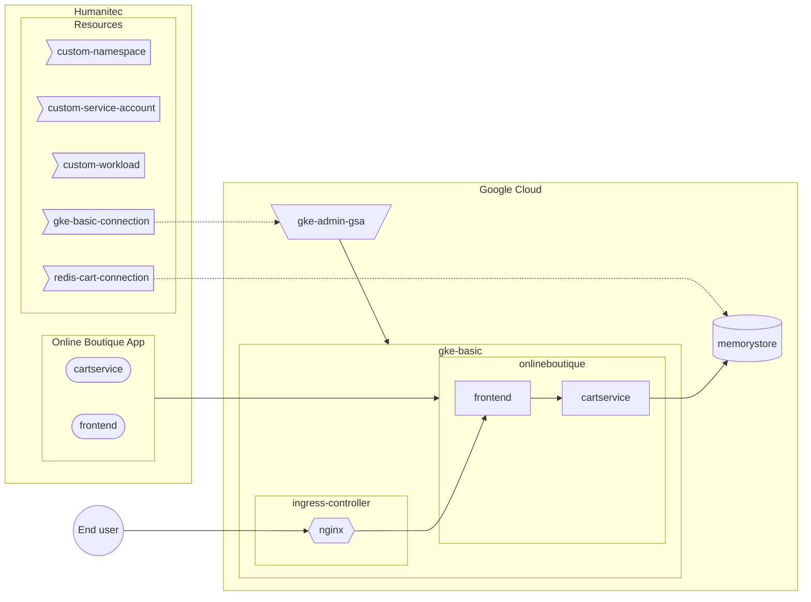

[_<< Previous section: Common setup_](/docs/common.md)

# GKE basic setup

- [[PA-GCP] Create the GKE cluster](#pa-gcp-create-the-gke-cluster)
- [[PA-GCP] Deploy the Nginx Ingress controller](#pa-gcp-deploy-the-nginx-ingress-controller)
- [[PA-GCP] Create the Google Service Account to access the GKE cluster](#pa-gcp-create-the-google-service-account-to-access-the-gke-cluster)
- [[PA-HUM] Create the GKE access resource definition](#pa-hum-create-the-gke-access-resource-definition)
- [[PA-HUM] Create the `gke-basic` Environment](#pa-hum-create-the-gke-basic-environment)
- [[PA-GCP] Create a Memorystore (Redis) database](#pa-gcp-create-a-memorystore-redis-database)
- [[PA-HUM] Create the Memorystore (Redis) access resource definition](#pa-hum-create-the-memorystore-redis-access-resource-definition)
- [[DE-HUM] Deploy the Online Boutique Workloads in `gke-basic` Environment](#de-hum-deploy-the-online-boutique-workloads-in-gke-basic-environment)
- [Test the Online Boutique website](#test-the-online-boutique-website)



```bash
PROJECT_ID=FIXME
gcloud config set project ${PROJECT_ID}
CLUSTER_NAME=gke-basic
REGION=northamerica-northeast1
ZONE=${REGION}-a
NETWORK=default
HUMANITEC_IP_ADDRESSES="34.159.97.57/32,35.198.74.96/32,34.141.77.162/32,34.89.188.214/32,34.159.140.35/32,34.89.165.141/32"
LOCAL_IP_ADRESS=$(curl -s ifconfig.co)

HUMANITEC_ORG=FIXME
export HUMANITEC_TOKEN=FIXME

ENVIRONMENT=${CLUSTER_NAME}
```

## [PA-GCP] Create the GKE cluster

As Platform Admin, in Google Cloud.

```bash
gcloud services enable container.googleapis.com
```

```bash
gcloud container clusters create ${CLUSTER_NAME} \
    --zone ${ZONE} \
    --network ${NETWORK} \
    --workload-pool=${PROJECT_ID}.svc.id.goog \
    --enable-master-authorized-networks \
    --master-authorized-networks ${HUMANITEC_IP_ADDRESSES},${LOCAL_IP_ADRESS}/32 \
    --no-enable-google-cloud-access
```

## [PA-GCP] Deploy the Nginx Ingress controller

As Platform Admin, in Google Cloud.

Deploy the Nginx Ingress Controller:
```bash
helm upgrade \
    --install ingress-nginx ingress-nginx \
    --repo https://kubernetes.github.io/ingress-nginx \
    --namespace ingress-nginx \
    --create-namespace
```

Grab the Public IP address of that Ingress Controller:
```bash
INGRESS_IP=$(kubectl get svc ingress-nginx-controller \
    -n ingress-nginx \
    -o jsonpath="{.status.loadBalancer.ingress[*].ip}")
```

## [PA-GCP] Create the Google Service Account to access the GKE cluster

As Platform Admin, in Google Cloud.

Create the Google Service Account (GSA) with the appropriate role:
```bash
GKE_ADMIN_SA_NAME=humanitec-to-${CLUSTER_NAME}
GKE_ADMIN_SA_ID=${GKE_ADMIN_SA_NAME}@${PROJECT_ID}.iam.gserviceaccount.com
gcloud iam service-accounts create ${GKE_ADMIN_SA_NAME} \
    --display-name=${GKE_ADMIN_SA_NAME}
gcloud projects add-iam-policy-binding ${PROJECT_ID} \
    --member "serviceAccount:${GKE_ADMIN_SA_ID}" \
    --role "roles/container.admin"
```

Download locally the GSA key:
```bash
gcloud iam service-accounts keys create ${GKE_ADMIN_SA_NAME}.json \
    --iam-account ${GKE_ADMIN_SA_ID}
```

## [PA-HUM] Create the GKE access resource definition

As Platform Admin, in Humanitec.

Create the GKE access resource definition:
```bash
cat <<EOF > ${CLUSTER_NAME}.yaml
id: ${CLUSTER_NAME}
name: ${CLUSTER_NAME}
type: k8s-cluster
driver_type: humanitec/k8s-cluster-gke
driver_inputs:
  values:
    loadbalancer: ${INGRESS_IP}
    name: ${CLUSTER_NAME}
    project_id: ${PROJECT_ID}
    zone: ${ZONE}
  secrets:
    credentials: $(cat ${GKE_ADMIN_SA_NAME}.json)
criteria:
  - env_id: ${ENVIRONMENT}
EOF
yq -o json ${CLUSTER_NAME}.yaml > ${CLUSTER_NAME}.json
curl "https://api.humanitec.io/orgs/${HUMANITEC_ORG}/resources/defs" \
    -X POST \
    -H "Content-Type: application/json" \
    -H "Authorization: Bearer ${HUMANITEC_TOKEN}" \
    -d @${CLUSTER_NAME}.json
```

Clean sensitive information locally:
```bash
rm ${GKE_ADMIN_SA_NAME}.json
rm ${CLUSTER_NAME}.yaml
rm ${CLUSTER_NAME}.json
```

## [PA-HUM] Create the `gke-basic` Environment

As Platform Admin, in Humanitec.

Create the new Environment by cloning the existing Environment from its latest Deployment:
```bash
CLONED_ENVIRONMENT=development
humctl create environment ${ENVIRONMENT} \
    --name ${ENVIRONMENT} \
    -t development \
    --context /orgs/${HUMANITEC_ORG}/apps/${ONLINEBOUTIQUE_APP} \
    --from ${CLONED_ENVIRONMENT}
```
<details>
  <summary>With curl.</summary>

  Get the latest Deployment's id of the existing Environment:
  ```bash
  CLONED_ENVIRONMENT=development
  LAST_DEPLOYMENT_IN_CLONED_ENVIRONMENT=$(curl "https://api.humanitec.io/orgs/${HUMANITEC_ORG}/apps/${ONLINEBOUTIQUE_APP}/envs/${CLONED_ENVIRONMENT}/deploys" \
      -s \
      -H "Authorization: Bearer ${HUMANITEC_TOKEN}" \
      -H "Content-Type: application/json" \
      | jq -r .[0].id)
  ```

  Create the new Environment by cloning the existing Environment from its latest Deployment:
  ```bash
  cat <<EOF > ${ONLINEBOUTIQUE_APP}-${ENVIRONMENT}-env.yaml
  from_deploy_id: ${LAST_DEPLOYMENT_IN_CLONED_ENVIRONMENT}
  id: ${ENVIRONMENT}
  name: ${ENVIRONMENT}
  type: development
  EOF
  yq -o json ${ONLINEBOUTIQUE_APP}-${ENVIRONMENT}-env.yaml > ${ONLINEBOUTIQUE_APP}-${ENVIRONMENT}-env.json
  curl "https://api.humanitec.io/orgs/${HUMANITEC_ORG}/apps/${ONLINEBOUTIQUE_APP}/envs" \
      -X POST \
      -H "Content-Type: application/json" \
      -H "Authorization: Bearer ${HUMANITEC_TOKEN}" \
      -d @${ONLINEBOUTIQUE_APP}-${ENVIRONMENT}-env.json
  ```
</details>

## [PA-GCP] Create a Memorystore (Redis) database

As Platform Admin, in Google Cloud.

Create the Memorystore (Redis) database with a password in same region and network as the GKE cluster:
```bash
gcloud services enable redis.googleapis.com

REDIS_NAME=redis-cart-${ENVIRONMENT}
gcloud redis instances create ${REDIS_NAME} \
    --size 1 \
    --region ${REGION} \
    --zone ${ZONE} \
    --network ${NETWORK} \
    --redis-version redis_6_x \
    --enable-auth
```

```bash
REDIS_HOST=$(gcloud redis instances describe ${REDIS_NAME} \
    --region ${REGION} \
    --format 'get(host)')
REDIS_PORT=$(gcloud redis instances describe ${REDIS_NAME} \
    --region ${REGION} \
    --format 'get(port)')
REDIS_AUTH=$(gcloud redis instances get-auth-string ${REDIS_NAME} \
    --region ${REGION} \
    --format 'get(authString)')
```

## [PA-HUM] Create the Memorystore (Redis) access resource definition

As Platform Admin, in Humanitec.

```bash
cat <<EOF > ${REDIS_NAME}.yaml
id: ${REDIS_NAME}
name: ${REDIS_NAME}
type: redis
driver_type: humanitec/static
driver_inputs:
  values:
    host: ${REDIS_HOST}
    port: ${REDIS_PORT}
  secrets:
    password: ${REDIS_AUTH}
criteria:
  - env_id: ${ENVIRONMENT}
EOF
yq -o json ${REDIS_NAME}.yaml > ${REDIS_NAME}.json
curl "https://api.humanitec.io/orgs/${HUMANITEC_ORG}/resources/defs" \
    -X POST \
    -H "Content-Type: application/json" \
    -H "Authorization: Bearer ${HUMANITEC_TOKEN}" \
    -d @${REDIS_NAME}.json
```

Clean sensitive information locally:
```bash
rm ${REDIS_NAME}.yaml
```

## [DE-HUM] Deploy the Online Boutique Workloads in `gke-basic` Environment

As Developer, in Humanitec.

```bash
FIRST_WORKLOAD="adservice"
COMBINED_DELTA=$(score-humanitec delta --app ${ONLINEBOUTIQUE_APP} --env ${ENVIRONMENT} --org ${HUMANITEC_ORG} --token ${HUMANITEC_TOKEN} --retry -f ${FIRST_WORKLOAD}/score.yaml --extensions ${FIRST_WORKLOAD}/humanitec.score.yaml | jq -r .id)
WORKLOADS="cartservice checkoutservice currencyservice emailservice frontend loadgenerator paymentservice productcatalogservice recommendationservice"
for w in ${WORKLOADS}; do COMBINED_DELTA=$(score-humanitec delta --app ${ONLINEBOUTIQUE_APP} --env ${ENVIRONMENT} --org ${HUMANITEC_ORG} --token ${HUMANITEC_TOKEN} --delta ${COMBINED_DELTA} --retry -f $w/score.yaml --extensions $w/humanitec.score.yaml | jq -r .id); done
LAST_WORKLOAD="shippingservice"
score-humanitec delta \
	--app ${ONLINEBOUTIQUE_APP} \
	--env ${ENVIRONMENT} \
	--org ${HUMANITEC_ORG} \
	--token ${HUMANITEC_TOKEN} \
	--deploy \
	--delta ${COMBINED_DELTA} \
	--retry \
	-f ${LAST_WORKLOAD}/score.yaml \
	--extensions ${LAST_WORKLOAD}/humanitec.score.yaml
```
_Note: `loadgenerator` is deployed to generate both: traffic on these apps and data in the database. If you don't want this, feel free to remove it from the above list of `WORKLOADS`._

## Test the Online Boutique website

Get the public DNS exposing the `frontend` Workload:
```bash
echo -e "https://$(humctl get active-resources /orgs/${HUMANITEC_ORG}/apps/${ONLINEBOUTIQUE_APP}/envs/${ENVIRONMENT}/resources \
    -o json \
    | jq -c '.[] | select(.object.type | contains("dns"))' \
    | jq -r .object.resource.host)"
```
<details>
  <summary>With curl.</summary>
  
  ```bash
  echo -e "https://$(curl "https://api.humanitec.io/orgs/${HUMANITEC_ORG}/apps/${ONLINEBOUTIQUE_APP}/envs/${ENVIRONMENT}/resources" \
      -s \
      -H "Authorization: Bearer ${HUMANITEC_TOKEN}" \
      -H "Content-Type: application/json" \
      | jq -c '.[] | select(.type | contains("dns"))' \
      | jq -r .resource.host)"
  ```
</details>

_Note: re-run the above command until you get a value._

[_Next section: GKE advanced setup >>_](/docs/gke-advanced.md)