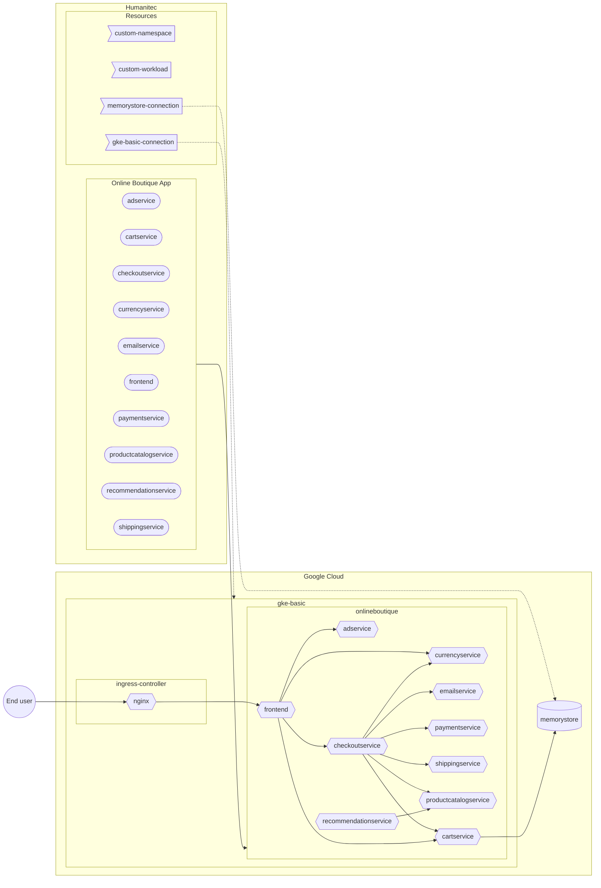

```bash
PROJECT_ID=FIXME
gcloud config set project ${PROJECT_ID}
CLUSTER_NAME=gke-basic
REGION=northamerica-northeast1
ZONE=${REGION}-a
HUMANITEC_IP_ADDRESSES="34.159.97.57/32,35.198.74.96/32,34.141.77.162/32,34.89.188.214/32,34.159.140.35/32,34.89.165.141/32"
```

## GKE cluster

```bash
gcloud services enable container.googleapis.com
```

```bash
gcloud container clusters create ${CLUSTER_NAME} \
    --zone ${ZONE} \
    --scopes cloud-platform \
    --workload-pool=${PROJECT_ID}.svc.id.goog \
    --enable-master-authorized-networks \
    --master-authorized-networks ${HUMANITEC_IP_ADDRESSES} \
    --no-enable-google-cloud-access
```

## Ingress controller

Deploy the Ingress Controller:
```bash
kubectl apply \
    -f https://raw.githubusercontent.com/kubernetes/ingress-nginx/controller-v1.7.0/deploy/static/provider/cloud/deploy.yaml
```

Let’s grab the Public IP address of that Ingress Controller:
```bash
INGRESS_IP=$(kubectl get svc ingress-nginx-controller \
    -n ingress-nginx \
    -o jsonpath="{.status.loadBalancer.ingress[*].ip}")
```

## GSA to access GKE

```bash
GKE_ADMIN_SA_NAME=humanitec-gke-dev
GKE_ADMIN_SA_ID=${SA_NAME}@${PROJECT_ID}.iam.gserviceaccount.com
gcloud iam service-accounts create ${GKE_ADMIN_SA_NAME} \
	--display-name=${GKE_ADMIN_SA_NAME}
gcloud projects add-iam-policy-binding ${PROJECT_ID} \
	--member "serviceAccount:${GKE_ADMIN_SA_ID}" \
	--role "roles/container.admin"
```

Let’s download locally the GSA key:
```bash
gcloud iam service-accounts keys create ${GKE_ADMIN_SA_NAME}.json \
    --iam-account ${GKE_ADMIN_SA_ID}
```

## Create the GKE connection in Humanitec

```bash
HUMANITEC_ORG=FIXME
HUMANITEC_TOKEN=FIXME
curl https://api.humanitec.io/orgs/${HUMANITEC_ORG}/resources/defs \
  -X POST \
  -H "Authorization: Bearer ${HUMANITEC_TOKEN}" \
  -H "Content-Type: application/json" \
  --data-binary "
{
  "id": "my-cluster",
  "name": "My Cluster",
  "type": "k8s-cluster",
  "criteria": [
    {
      "env_type": "development"
    }
  ],
  "driver_type": "humanitec/k8s-cluster-gke",
  "driver_inputs": {
    "values": {
      "loadbalancer": ${INGRESS_IP}
      "name": ${CLUSTER_NAME}
      "project_id":${PROJECT_ID}
      "zone": ${ZONE}
    },
    "secrets": {
      "credentials": $(cat ${GKE_ADMIN_SA_NAME}.json)
    }
  }
}"
```

Remove the local GSA's key:
```bash
rm ${GKE_ADMIN_SA_NAME}.json
```

## Memorystore (Redis) database

```bash
gcloud services enable redis.googleapis.com

REDIS_NAME=redis-cart
gcloud redis instances create ${REDIS_NAME} \
    --size 1 \
    --region ${REGION} \
    --zone ${ZONE} \
    --redis-version redis_6_x \
    --enable-auth
```

```bash
gcloud redis instances describe ${REDIS_NAME} \
   --region ${REGION} \
   --format 'get(host)'

gcloud redis instances describe ${REDIS_NAME} \
   --region ${REGION} \
   --format 'get(port)'

gcloud redis instances get-auth-string ${REDIS_NAME} \
   --region ${REGION}
```

FIXME - create a static Redis resource definition