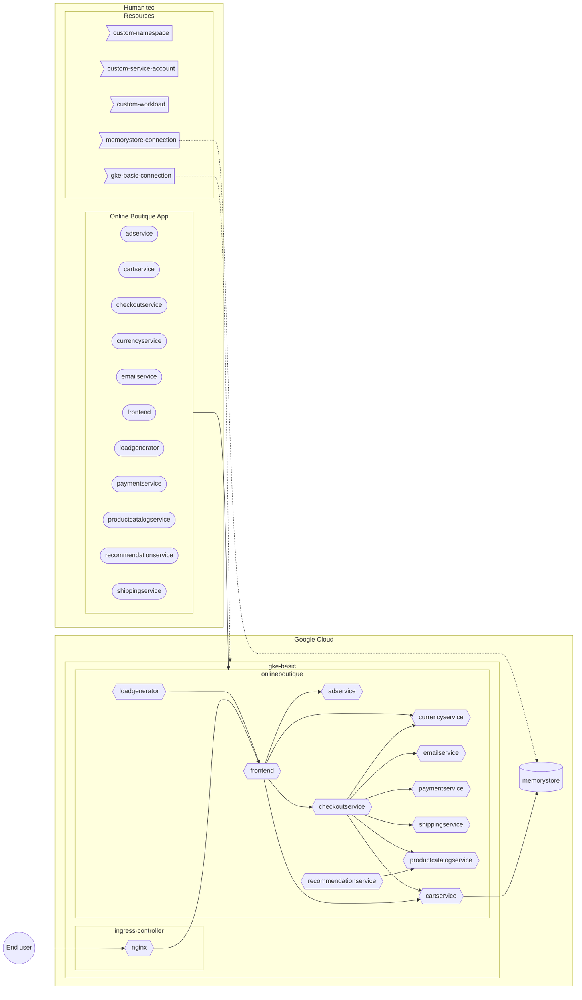

[_<< Previous section: Common setup_](/docs/common.md)

# GKE basic setup

- [[PA-GCP] Create the GKE cluster](#pa-gcp-create-the-gke-cluster)
- [[PA-GCP] Deploy the Nginx Ingress controller](#pa-gcp-deploy-the-nginx-ingress-controller)
- [[PA-GCP] Create the Google Service Account to access the GKE cluster](#pa-gcp-create-the-google-service-account-to-access-the-gke-cluster)
- [[PA-HUM] Create the GKE access resource definition](#pa-hum-create-the-gke-access-resource-definition)
- [[PA-HUM] Create the `gke-basic` Environment](#pa-hum-create-the-gke-basic-environment)
- [[DE-HUM] Deploy the Online Boutique Workloads (with in-cluster `redis`) in `gke-basic` Environment](#de-hum-deploy-the-online-boutique-workloads-with-in-cluster-redis-in-gke-basic-environment)
- [[PA-GCP] Create a Memorystore (Redis) database](#pa-gcp-create-a-memorystore-redis-database)
- [[PA-HUM] Create the Memorystore (Redis) access resource definition](#pa-hum-create-the-memorystore-redis-access-resource-definition)
- [[DE-HUM] Deploy the `cartservice` Workload with Memorystore (Redis) in `gke-basic` Environment](#de-hum-deploy-the-cartservice-workload-with-memorystore-redis-in-gke-basic-environment)



```bash
PROJECT_ID=FIXME
gcloud config set project ${PROJECT_ID}
CLUSTER_NAME=gke-basic
REGION=northamerica-northeast1
ZONE=${REGION}-a
HUMANITEC_IP_ADDRESSES="34.159.97.57/32,35.198.74.96/32,34.141.77.162/32,34.89.188.214/32,34.159.140.35/32,34.89.165.141/32"

HUMANITEC_ORG=FIXME
HUMANITEC_TOKEN=FIXME

ENVIRONMENT=${CLUSTER_NAME}
```

## [PA-GCP] Create the GKE cluster

As Platform Admin, in Google Cloud.

```bash
gcloud services enable container.googleapis.com
```

```bash
gcloud container clusters create ${CLUSTER_NAME} \
    --zone ${ZONE} \
    --scopes cloud-platform \
    --workload-pool=${PROJECT_ID}.svc.id.goog \
    --enable-master-authorized-networks \
    --master-authorized-networks ${HUMANITEC_IP_ADDRESSES} \
    --no-enable-google-cloud-access
```
_Note: here we are restricting the access to the public Kubernetes server API only by Humanitec. If you want to access this cluster from your local machine, you need to add your own IP address here too._

## [PA-GCP] Deploy the Nginx Ingress controller

As Platform Admin, in Google Cloud.

Deploy the Nginx Ingress Controller:
```bash
NGING_INGRESS_CONTROLLER_VERSION=1.7.0
kubectl apply \
    -f https://raw.githubusercontent.com/kubernetes/ingress-nginx/controller-v${NGING_INGRESS_CONTROLLER_VERSION}/deploy/static/provider/cloud/deploy.yaml
```

Grab the Public IP address of that Ingress Controller:
```bash
INGRESS_IP=$(kubectl get svc ingress-nginx-controller \
    -n ingress-nginx \
    -o jsonpath="{.status.loadBalancer.ingress[*].ip}")
```

## [PA-GCP] Create the Google Service Account to access the GKE cluster

As Platform Admin, in Google Cloud.

Create the Google Service Account (GSA) with the appropriate role:
```bash
GKE_ADMIN_SA_NAME=humanitec-access-to-${CLUSTER_NAME}
GKE_ADMIN_SA_ID=${SA_NAME}@${PROJECT_ID}.iam.gserviceaccount.com
gcloud iam service-accounts create ${GKE_ADMIN_SA_NAME} \
	--display-name=${GKE_ADMIN_SA_NAME}
gcloud projects add-iam-policy-binding ${PROJECT_ID} \
	--member "serviceAccount:${GKE_ADMIN_SA_ID}" \
	--role "roles/container.admin"
```

Download locally the GSA key:
```bash
gcloud iam service-accounts keys create ${GKE_ADMIN_SA_NAME}.json \
    --iam-account ${GKE_ADMIN_SA_ID}
```

## [PA-HUM] Create the GKE access resource definition

As Platform Admin, in Humanitec.

```bash
cat <<EOF > ${CLUSTER_NAME}.yaml
id: ${CLUSTER_NAME}
name: ${CLUSTER_NAME}
type: k8s-cluster
driver_type: humanitec/k8s-cluster-gke
driver_inputs:
  values:
    loadbalancer: ${INGRESS_IP}
    name: gke-dev
    project_id: ${PROJECT_ID}
    zone: ${ZONE}
  secrets:
    credentials: $(cat ${GKE_ADMIN_SA_NAME}.json)
criteria:
  - env_id: ${ENVIRONMENT}
EOF
yq -o json ${CLUSTER_NAME}.yaml > ${CLUSTER_NAME}.json
curl -X POST "https://api.humanitec.io/orgs/${HUMANITEC_ORG}/resources/defs" \
  -H "Content-Type: application/json" \
	-H "Authorization: Bearer ${HUMANITEC_TOKEN}" \
  -d @${CLUSTER_NAME}.json
```

Clean sensitive information locally:
```bash
rm ${GKE_ADMIN_SA_NAME}.json
```

## [PA-HUM] Create the `gke-basic` Environment

As Platform Admin, in Humanitec.

Get the last Deployment's id for the `development` Environment:
```bash
LAST_DEPLOYMENT_IN_DEVELOPMENT=$(curl -s https://api.humanitec.io/orgs/${HUMANITEC_ORG}/apps/${ONLINEBOUTIQUE_APP}/envs/${ENVIRONMENT}/deploys \
	-H "Authorization: Bearer ${HUMANITEC_TOKEN}" \
	-H "Content-Type: application/json" \
	| jq -r .[0].id)
```

Create the `gke-basic` Environment based on the last Deployment in the `development` Environment:
```bash
cat <<EOF > ${ENVIRONMENT}-env.yaml
from_deploy_id: ${LAST_DEPLOYMENT_IN_DEVELOPMENT}
id: ${ENVIRONMENT}
name: ${ENVIRONMENT}
type: development
EOF
yq -o json ${ENVIRONMENT}-env.yaml > ${ENVIRONMENT}-env.json
curl -X POST "https://api.humanitec.io/orgs/${HUMANITEC_ORG}/apps/${ONLINEBOUTIQUE_APP}/envs" \
  -H "Content-Type: application/json" \
	-H "Authorization: Bearer ${HUMANITEC_TOKEN}" \
  -d @${ENVIRONMENT}-env.json
```

## [DE-HUM] Deploy the Online Boutique Workloads (with in-cluster `redis`) in `gke-basic` Environment

As Developer, in Humanitec.

```bash
FIRST_WORKLOAD="adservice"
COMBINED_DELTA=$(score-humanitec delta --app ${ONLINEBOUTIQUE_APP} --env ${ENVIRONMENT} --org ${HUMANITEC_ORG} --token ${HUMANITEC_TOKEN} --retry -f ${FIRST_WORKLOAD}/score.yaml --extensions ${FIRST_WORKLOAD}/humanitec.score.yaml | jq -r .id)
WORKLOADS="cartservice checkoutservice currencyservice emailservice frontend loadgenerator paymentservice productcatalogservice recommendationservice redis"
for w in ${WORKLOADS}; do COMBINED_DELTA=$(score-humanitec delta --app ${ONLINEBOUTIQUE_APP} --env ${ENVIRONMENT} --org ${HUMANITEC_ORG} --token ${HUMANITEC_TOKEN} --delta ${COMBINED_DELTA} --retry -f $w/score.yaml --extensions $w/humanitec.score.yaml | jq -r .id); done
LAST_WORKLOAD="shippingservice"
score-humanitec delta \
	--app ${ONLINEBOUTIQUE_APP} \
	--env ${ENVIRONMENT} \
	--org ${HUMANITEC_ORG} \
	--token ${HUMANITEC_TOKEN} \
	--deploy \
	--delta ${COMBINED_DELTA} \
	--retry \
	-f ${LAST_WORKLOAD}/score.yaml \
	--extensions ${LAST_WORKLOAD}/humanitec.score.yaml
```
_Note: `loadgenerator` is deployed to generate both: traffic on these apps and data in the database. If you don't want this, feel free to remove it from the above list of `WORKLOADS`._

Get the public DNS exposing the `frontend` Workload:
```bash
curl -s https://api.humanitec.io/orgs/${HUMANITEC_ORG}/apps/${ONLINEBOUTIQUE_APP}/envs/${ENVIRONMENT}/resources \
	-H "Authorization: Bearer ${HUMANITEC_TOKEN}" \
	-H "Content-Type: application/json" \
	| jq -c '.[] | select(.type | contains("dns"))' \
	| jq -r .resource.host
```

## [PA-GCP] Create a Memorystore (Redis) database

As Platform Admin, in Google Cloud.

Create the Memorystore (Redis) database with a password in same region and network as the GKE cluster:
```bash
gcloud services enable redis.googleapis.com

REDIS_NAME=redis-cart-${ENVIRONMENT}
gcloud redis instances create ${REDIS_NAME} \
    --size 1 \
    --region ${REGION} \
    --zone ${ZONE} \
    --redis-version redis_6_x \
    --enable-auth
```

```bash
REDIS_HOST=$(gcloud redis instances describe ${REDIS_NAME} \
    --region ${REGION} \
    --format 'get(host)')
REDIS_PORT=$(gcloud redis instances describe ${REDIS_NAME} \
    --region ${REGION} \
    --format 'get(port)')
REDIS_AUTH=$(gcloud redis instances get-auth-string ${REDIS_NAME} \
    --region ${REGION} \
    --format 'get(authString)')
```

## [PA-HUM] Create the Memorystore (Redis) access resource definition

As Platform Admin, in Humanitec.

```bash
cat <<EOF > ${REDIS_NAME}.yaml
id: ${REDIS_NAME}
name: ${REDIS_NAME}
type: redis
driver_type: humanitec/static
driver_inputs:
  values:
    host: ${REDIS_HOST}
    port: ${REDIS_PORT}
  secrets:
    password: ${REDIS_AUTH}
criteria:
  - env_id: ${ENVIRONMENT}
EOF
yq -o json ${REDIS_NAME}.yaml > ${REDIS_NAME}.json
curl -X POST "https://api.humanitec.io/orgs/${HUMANITEC_ORG}/resources/defs" \
  -H "Content-Type: application/json" \
	-H "Authorization: Bearer ${HUMANITEC_TOKEN}" \
  -d @${REDIS_NAME}.json
```

Clean sensitive information locally:
```bash
rm ${REDIS_NAME}.yaml
```

## [DE-HUM] Deploy the `cartservice` Workload with Memorystore (Redis) in `gke-basic` Environment

As Developer, in Humanitec.

```bash
WORKLOAD=cartservice
score-humanitec delta \
	--app ${ONLINEBOUTIQUE_APP} \
	--env ${ENVIRONMENT} \
	--org ${HUMANITEC_ORG} \
	--token ${HUMANITEC_TOKEN} \
	--deploy \
	--retry \
	-f ${WORKLOAD}/score-memorystore.yaml \
	--extensions ${WORKLOAD}/humanitec.score.yaml
```

Get the public DNS exposing the `frontend` Workload:
```bash
curl -s https://api.humanitec.io/orgs/${HUMANITEC_ORG}/apps/${ONLINEBOUTIQUE_APP}/envs/${ENVIRONMENT}/resources \
	-H "Authorization: Bearer ${HUMANITEC_TOKEN}" \
	-H "Content-Type: application/json" \
	| jq -c '.[] | select(.type | contains("dns"))' \
	| jq -r .resource.host
```

[_Next section: GKE advanced setup >>_](/docs/gke-advanced.md)