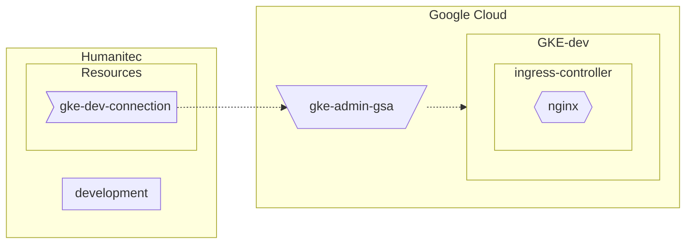

```bash
PROJECT_ID=FIXME
gcloud config set project ${PROJECT_ID}
CLUSTER_NAME=gke-dev
REGION=northamerica-northeast1
ZONE=${REGION}-a
```

## GKE cluster

```bash
gcloud services enable container.googleapis.com
```

### Basic



```bash
gcloud container clusters create ${CLUSTER_NAME} \
    --zone ${ZONE} \
    --scopes cloud-platform \
    --workload-pool=${PROJECT_ID}.svc.id.goog \
    --enable-master-authorized-networks \
    --master-authorized-networks 34.159.97.57/32,35.198.74.96/32,34.141.77.162/32,34.89.188.214/32,34.159.140.35/32,34.89.165.141/32 \
    --no-enable-google-cloud-access
```

### Advanced


```bash
# Least Privilege Service Account for default node pool
gcloud services enable cloudresourcemanager.googleapis.com
GKE_NODE_SA_NAME=${CLUSTER_NAME}-sa
GKE_NODE_SA_ID=${GKE_NODE_SA_NAME}@${PROJECT_ID}.iam.gserviceaccount.com
gcloud iam service-accounts create ${GKE_NODE_SA_NAME} \
  --display-name=${GKE_NODE_SA_NAME}
roles="roles/logging.logWriter roles/monitoring.metricWriter roles/monitoring.viewer"
for r in $roles; do gcloud projects add-iam-policy-binding ${PROJECT_ID} --member "serviceAccount:${GKE_NODE_SA_ID}" --role $r; done
  
## Artifact Registry
gcloud services enable artifactregistry.googleapis.com
CONTAINERS_REGISTRY_NAME=containers
gcloud artifacts repositories create $containerRegistryName \
    --location $region \
    --repository-format docker
gcloud services enable containeranalysis.googleapis.com
gcloud services enable containerscanning.googleapis.com
gcloud artifacts repositories add-iam-policy-binding $containerRegistryName \
    --location $region \
    --member "serviceAccount:$gkeSaId" \
    --role roles/artifactregistry.reader

# GKE Security posture
gcloud services enable containersecurity.googleapis.com

gcloud container clusters create ${CLUSTER_NAME} \
    --zone ${ZONE} \
    --scopes cloud-platform \
    --workload-pool=${PROJECT_ID}.svc.id.goog \
    --enable-master-authorized-networks \
    --master-authorized-networks 34.159.97.57/32,35.198.74.96/32,34.141.77.162/32,34.89.188.214/32,34.159.140.35/32,34.89.165.141/32 \
    --no-enable-google-cloud-access \
    --service-account ${GKE_NODE_SA_ID} \
    --enable-workload-vulnerability-scanning \
    --enable-workload-config-audit \
    --enable-confidential-nodes \
    --release-channel rapid \
    --enable-dataplane-v2 \
    --shielded-secure-boot
```

## Ingress controller

Deploy the Ingress Controller:
```bash
kubectl apply \
    -f https://raw.githubusercontent.com/kubernetes/ingress-nginx/controller-v1.7.0/deploy/static/provider/cloud/deploy.yaml
```

Let’s grab the Public IP address of that Ingress Controller:
```bash
INGRESS_IP=$(kubectl get svc ingress-nginx-controller \
    -n ingress-nginx \
    -o jsonpath="{.status.loadBalancer.ingress[*].ip}")
```

## GSA to access GKE

```bash
SA_NAME=humanitec-dev
SA_ID=${SA_NAME}@${PROJECT_ID}.iam.gserviceaccount.com
gcloud iam service-accounts create ${SA_NAME} \
	--display-name=${SA_NAME}
gcloud projects add-iam-policy-binding ${PROJECT_ID} \
	--member "serviceAccount:${SA_ID}" \
	--role "roles/container.admin"
```

Let’s download locally the GSA key:
```bash
gcloud iam service-accounts keys create ${SA_NAME}.json \
    --iam-account ${SA_ID}
```

## Create the GKE connection in Humanitec

```
HUMANITEC_ORG=FIXME
HUMANITEC_TOKEN=FIXME
curl https://api.humanitec.io/orgs/${HUMANITEC_ORG}/resources/defs \
  -X POST \
  -H "Authorization: Bearer ${HUMANITEC_TOKEN}" \
  -H "Content-Type: application/json" \
  --data-binary "
{
  "id": "my-cluster",
  "name": "My Cluster",
  "type": "k8s-cluster",
  "criteria": [
    {
      "env_type": "development"
    }
  ],
  "driver_type": "humanitec/k8s-cluster-gke",
  "driver_inputs": {
    "values": {
      "loadbalancer": ${INGRESS_IP}
      "name": ${CLUSTER_NAME}
      "project_id":${PROJECT_ID}
      "zone": ${ZONE}
    },
    "secrets": {
      "credentials": $(cat ${SA_NAME}.json)
    }
  }
}"
```
