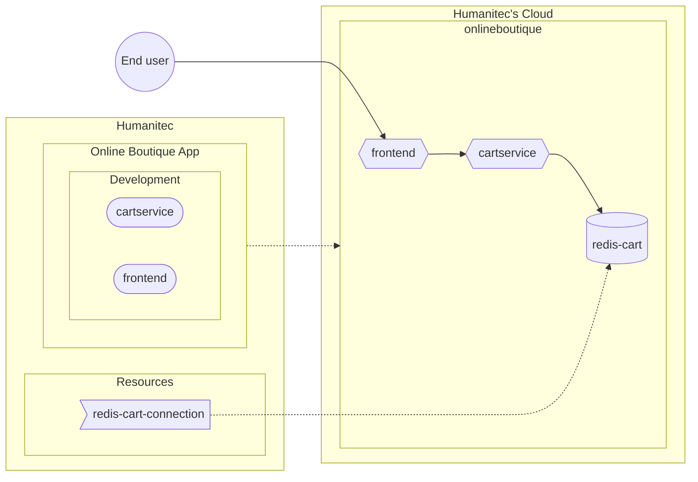

[_Next section: Common setup >>_](/docs/common.md)

## Humanitec default setup in Development

- [[PA-HUM] Create the Online Boutique App](#pa-hum-create-the-online-boutique-app)
- [[PA-HUM] Create the in-cluster Redis resource definition](#pa-hum-create-the-in-cluster-redis-resource-definition)
- [[DE-HUM] Deploy the Online Boutique Workloads in Development Environment](#de-hum-deploy-the-online-boutique-workloads-in-development-environment)
- [Test the Online Boutique website](#test-the-online-boutique-website)



```bash
HUMANITEC_ORG=FIXME
export HUMANITEC_CONTEXT=/orgs/${HUMANITEC_ORG}
export HUMANITEC_TOKEN=FIXME

ENVIRONMENT=development
```

Before starting, let's clone this current GitHub repository, you will need to have the files locally:
```bash
git clone https://github.com/mathieu-benoit/hello-humanitec
cd hello-humanitec/
```

## [PA-HUM] Create the Online Boutique App

As Platform Admin, in Humanitec.

```bash
ONLINEBOUTIQUE_APP=onlineboutique
humctl create app ${ONLINEBOUTIQUE_APP} \
    --name ${ONLINEBOUTIQUE_APP}
```

<details>
  <summary>With curl.</summary>
  
  ```bash
  ONLINEBOUTIQUE_APP=onlineboutique
  curl "https://api.humanitec.io/orgs/${HUMANITEC_ORG}/apps" \
      -X POST \
      -H "Authorization: Bearer ${HUMANITEC_TOKEN}" \
      -H "Content-Type: application/json" \
      -d @- <<EOF
  {
    "id": "${ONLINEBOUTIQUE_APP}", 
    "name": "Online Boutique"
  }
  EOF
  ```
</details>

## [PA-HUM] Create the in-cluster Redis resource definition

As Platform Admin, in Humanitec.

Create the in-cluster Redis resource definition:
```bash
REDIS_NAME=redis-cart
REDIS_PORT=6379
cat <<EOF > ${REDIS_NAME}-in-cluster.yaml
apiVersion: core.api.humanitec.io/v1
kind: Definition
metadata:
  id: ${REDIS_NAME}-in-cluster
object:
  name: ${REDIS_NAME}-in-cluster
  type: redis
  driver_type: humanitec/template
  driver_inputs:
    values:
      templates:
        manifests: |-
          deployment.yaml:
            location: namespace
            data:
              apiVersion: apps/v1
              kind: Deployment
              metadata:
                name: ${REDIS_NAME}
              spec:
                selector:
                  matchLabels:
                    app: ${REDIS_NAME}
                template:
                  metadata:
                    labels:
                      app: ${REDIS_NAME}
                  spec:
                    securityContext:
                      fsGroup: 1000
                      runAsGroup: 1000
                      runAsNonRoot: true
                      runAsUser: 1000
                      seccompProfile:
                        type: RuntimeDefault
                    containers:
                    - name: redis
                      securityContext:
                        allowPrivilegeEscalation: false
                        capabilities:
                          drop:
                            - ALL
                        privileged: false
                        readOnlyRootFilesystem: true
                      image: redis:alpine
                      ports:
                      - containerPort: ${REDIS_PORT}
                      volumeMounts:
                      - mountPath: /data
                        name: redis-data
                    volumes:
                    - name: redis-data
                      emptyDir: {}
          service.yaml:
            location: namespace
            data:
              apiVersion: v1
              kind: Service
              metadata:
                name: ${REDIS_NAME}
              spec:
                type: ClusterIP
                selector:
                  app: ${REDIS_NAME}
                ports:
                - name: tcp-redis
                  port: ${REDIS_PORT}
                  targetPort: ${REDIS_PORT}
        outputs: |
          host: ${REDIS_NAME}
          port: ${REDIS_PORT}
  criteria:
    - {}
EOF
humctl create \
    -f ${REDIS_NAME}-in-cluster.yaml
```

## [DE-HUM] Deploy the Online Boutique Workloads in Development Environment

As Developer, in Humanitec.

```bash
FIRST_WORKLOAD="adservice"
COMBINED_DELTA=$(score-humanitec delta --app ${ONLINEBOUTIQUE_APP} --env ${ENVIRONMENT} --org ${HUMANITEC_ORG} --token ${HUMANITEC_TOKEN} --retry -f samples/onlineboutique/${FIRST_WORKLOAD}/score.yaml --extensions samples/onlineboutique/${FIRST_WORKLOAD}/humanitec.score.yaml | jq -r .id)
WORKLOADS="cartservice checkoutservice currencyservice emailservice frontend loadgenerator paymentservice productcatalogservice recommendationservice shippingservice"
for w in ${WORKLOADS}; do \
    COMBINED_DELTA=$(score-humanitec delta \
        --app ${ONLINEBOUTIQUE_APP} \
        --env ${ENVIRONMENT} \
        --org ${HUMANITEC_ORG} \
        --token ${HUMANITEC_TOKEN} \
        --delta ${COMBINED_DELTA} \
        --retry \
        -f samples/onlineboutique/$w/score.yaml \
        --extensions samples/onlineboutique/$w/humanitec.score.yaml \
        | jq -r .id); \
done
humctl deploy delta ${COMBINED_DELTA} ${ENVIRONMENT} \
    --context /orgs/${HUMANITEC_ORG}/apps/${ONLINEBOUTIQUE_APP}
```
_Note: `loadgenerator` is deployed to generate both: traffic on these apps and data in the database. If you don't want this, feel free to remove it from the above list of `WORKLOADS`._

## Test the Online Boutique website

Get the public DNS exposing the `frontend` Workload:
```bash
echo -e "https://$(humctl get active-resources \
    --context /orgs/${HUMANITEC_ORG}/apps/${ONLINEBOUTIQUE_APP}/envs/${ENVIRONMENT} \
    -o json \
    | jq -c '.[] | select(.object.type | contains("dns"))' \
    | jq -r .object.resource.host)"
```
<details>
  <summary>With curl.</summary>
  
  ```bash
  echo -e "https://$(curl "https://api.humanitec.io/orgs/${HUMANITEC_ORG}/apps/${ONLINEBOUTIQUE_APP}/envs/${ENVIRONMENT}/resources" \
      -s \
      -H "Authorization: Bearer ${HUMANITEC_TOKEN}" \
      -H "Content-Type: application/json" \
      | jq -c '.[] | select(.type | contains("dns"))' \
      | jq -r .resource.host)"
  ```
</details>

_Note: re-run the above command until you get a value._

[_Next section: Common setup >>_](/docs/common.md)
