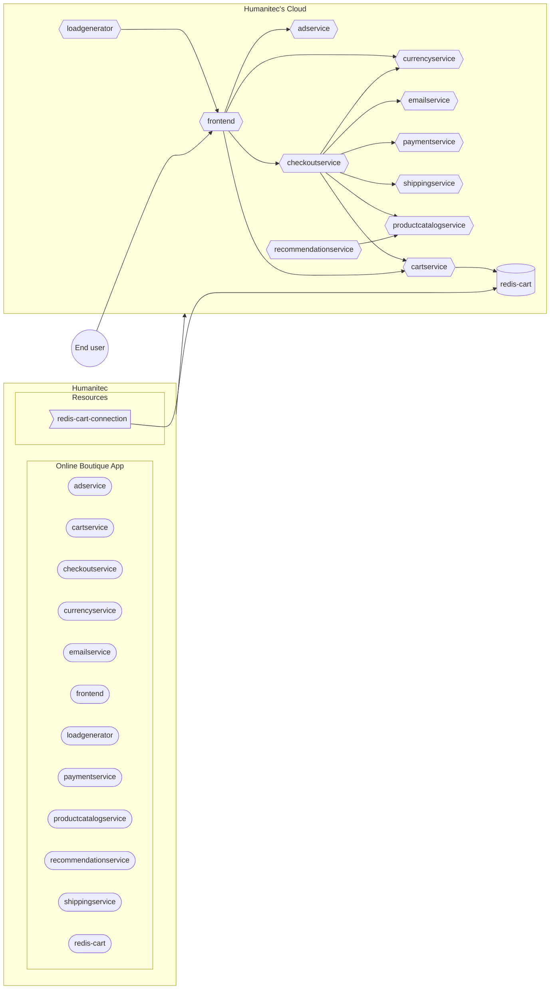

## Online Boutique

- [[PA-HUM] Create the Online Boutique App](#pa-hum-create-the-online-boutique-app)
- [[PA-HUM] Create an in-cluster Redis database](#pa-hum-create-an-in-cluster-redis-database)
- [[PA-HUM] Create the in-cluster Redis access resource definition](#pa-hum-create-the-in-cluster-redis-access-resource-definition)
- [[DE-HUM] Deploy the Online Boutique Workloads in `development` Environment](#de-hum-deploy-the-online-boutique-workloads-in-development-environment)
- [Test the Online Boutique website](#test-the-online-boutique-website)



```bash
HUMANITEC_ORG=FIXME
export HUMANITEC_TOKEN=FIXME
```

## [PA-HUM] Create the Online Boutique App

As Platform Admin, in Humanitec.

```bash
ONLINEBOUTIQUE_APP=onlineboutique
humctl create app /orgs/${HUMANITEC_ORG}/apps/${ONLINEBOUTIQUE_APP} \
	--conext /orgs/${HUMANITEC_ORG} \
  --name ${ONLINEBOUTIQUE_APP}
```

<details>
  <summary>With curl.</summary>
  
  ```bash
  ONLINEBOUTIQUE_APP=onlineboutique
  curl "https://api.humanitec.io/orgs/${HUMANITEC_ORG}/apps" \
      -X POST \
      -H "Authorization: Bearer ${HUMANITEC_TOKEN}" \
      -H "Content-Type: application/json" \
      -d @- <<EOF
  {
    "id": "${ONLINEBOUTIQUE_APP}", 
    "name": "Online Boutique"
  }
  EOF
  ```
</details>

## [PA-HUM] Create an in-cluster Redis database

As Platform Admin, in Humanitec.

Create the in-cluster `redis-cart` database as a Workload:
```bash
REDIS_NAME=redis-cart
score-humanitec delta \
    --app ${ONLINEBOUTIQUE_APP} \
    --env ${ENVIRONMENT} \
    --org ${HUMANITEC_ORG} \
    --token ${HUMANITEC_TOKEN} \
    --deploy \
    --retry \
    -f ${REDIS_NAME}/score.yaml \
    --extensions ${REDIS_NAME}/humanitec.score.yaml
```
_Note: this part in the near future will be replaced by a Redis resource definition deploying 

## [PA-HUM] Create the in-cluster Redis access resource definition

As Platform Admin, in Humanitec.

```bash
REDIS_HOST=redis-cart
REDIS_PORT=6379
cat <<EOF > ${REDIS_NAME}-${ENVIRONMENT}.yaml
id: ${REDIS_NAME}-${ENVIRONMENT}
name: ${REDIS_NAME}-${ENVIRONMENT}
type: redis
driver_type: humanitec/static
driver_inputs:
  values:
    host: ${REDIS_HOST}
    port: ${REDIS_PORT}
criteria:
  - env_id: ${ENVIRONMENT}
EOF
yq -o json ${REDIS_NAME}-${ENVIRONMENT}.yaml > ${REDIS_NAME}-${ENVIRONMENT}.json
curl "https://api.humanitec.io/orgs/${HUMANITEC_ORG}/resources/defs" \
    -X POST \
    -H "Content-Type: application/json" \
    -H "Authorization: Bearer ${HUMANITEC_TOKEN}" \
    -d @${REDIS_NAME}-${ENVIRONMENT}.json
```

## [DE-HUM] Deploy the Online Boutique Workloads in `development` Environment

As Developer, in Humanitec.

```bash
FIRST_WORKLOAD="adservice"
COMBINED_DELTA=$(score-humanitec delta --app ${ONLINEBOUTIQUE_APP} --env ${ENVIRONMENT} --org ${HUMANITEC_ORG} --token ${HUMANITEC_TOKEN} --retry -f ${FIRST_WORKLOAD}/score.yaml --extensions ${FIRST_WORKLOAD}/humanitec.score.yaml | jq -r .id)
WORKLOADS="cartservice checkoutservice currencyservice emailservice frontend loadgenerator paymentservice productcatalogservice recommendationservice"
for w in ${WORKLOADS}; do COMBINED_DELTA=$(score-humanitec delta --app ${ONLINEBOUTIQUE_APP} --env ${ENVIRONMENT} --org ${HUMANITEC_ORG} --token ${HUMANITEC_TOKEN} --delta ${COMBINED_DELTA} --retry -f $w/score.yaml --extensions $w/humanitec.score.yaml | jq -r .id); done
LAST_WORKLOAD="shippingservice"
score-humanitec delta \
	--app ${ONLINEBOUTIQUE_APP} \
	--env ${ENVIRONMENT} \
	--org ${HUMANITEC_ORG} \
	--token ${HUMANITEC_TOKEN} \
	--deploy \
	--delta ${COMBINED_DELTA} \
	--retry \
	-f ${LAST_WORKLOAD}/score.yaml \
	--extensions ${LAST_WORKLOAD}/humanitec.score.yaml
```
_Note: `loadgenerator` is deployed to generate both: traffic on these apps and data in the database. If you don't want this, feel free to remove it from the above list of `WORKLOADS`._

## Test the Online Boutique website

Get the public DNS exposing the `frontend` Workload:
```bash
echo -e "https://$(humctl get active-resources /orgs/${HUMANITEC_ORG}/apps/${ONLINEBOUTIQUE_APP}/envs/${ENVIRONMENT}/resources \
    -o json \
    | jq -c '.[] | select(.object.type | contains("dns"))' \
    | jq -r .object.resource.host)"
```
<details>
  <summary>With curl.</summary>
  
  ```bash
  echo -e "https://$(curl "https://api.humanitec.io/orgs/${HUMANITEC_ORG}/apps/${ONLINEBOUTIQUE_APP}/envs/${ENVIRONMENT}/resources" \
      -s \
      -H "Authorization: Bearer ${HUMANITEC_TOKEN}" \
      -H "Content-Type: application/json" \
      | jq -c '.[] | select(.type | contains("dns"))' \
      | jq -r .resource.host)"
  ```
</details>

_Note: re-run the above command until you get a value._

[_Next section: Common setup >>_](/docs/common.md)