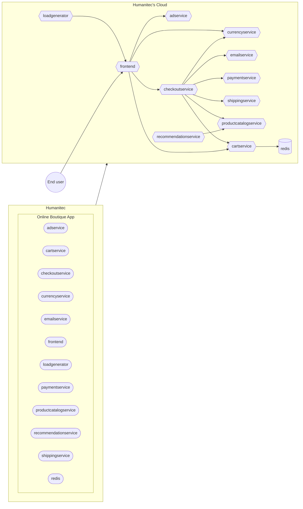

## Online Boutique

- [(Platform admin) Create the Online Boutique App in Humanitec](#create-the-online-boutique-app-in-humanitec)
- [(Developer) Deploy the Online Boutique Workloads in `development` Environment](#deploy-the-online-boutique-workloads-in-development-environment)



## Create the Online Boutique App in Humanitec

```bash
ONLINEBOUTIQUE_APP=onlineboutique
curl https://api.humanitec.io/orgs/${HUMANITEC_ORG}/apps \
  -X POST \
  -H "Authorization: Bearer ${HUMANITEC_TOKEN}" \
  -H "Content-Type: application/json" \
  -d @- <<EOF
{
  "id": "${ONLINEBOUTIQUE_APP}", 
  "name": "Online Boutique"
}
EOF
```

## Deploy the Online Boutique Workloads in `development` Environment

```bash
ENVIRONMENT=development
WORKLOADS="adservice cartservice checkoutservice currencyservice emailservice frontend loadgenerator paymentservice productcatalogservice recommendationservice redis shippingservice"
for w in ${WORKLOADS}; do score-humanitec delta --app ${ONLINEBOUTIQUE_APP} --env ${ENVIRONMENT} --org ${HUMANITEC_ORG} --token ${HUMANITEC_TOKEN} --deploy --retry -f samples/onlineboutique/$w/score.yaml --extensions samples/onlineboutique/$w/humanitec.score.yaml; done
```