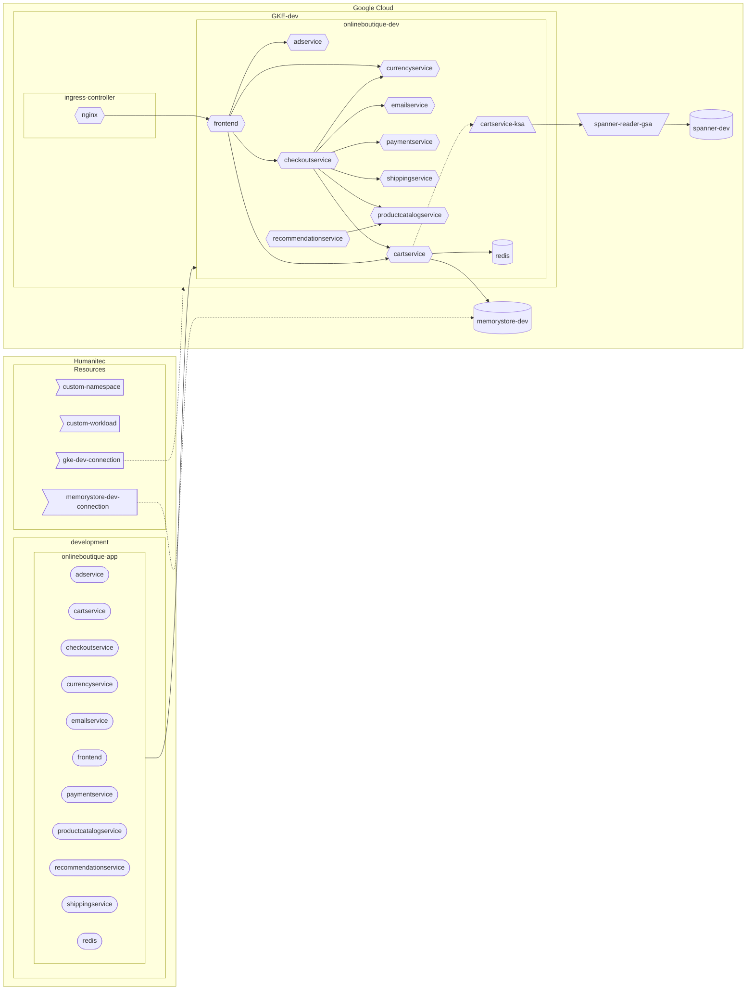

## Online Boutique



## Humanitec App

```bash
ONLINEBOUTIQUE_APP=onlineboutique
curl https://api.humanitec.io/orgs/${HUMANITEC_ORG}/apps \
  -X POST \
  -H "Authorization: Bearer ${HUMANITEC_TOKEN}" \
  -H "Content-Type: application/json" \
  -d @- <<EOF
{
  "id": "${ONLINEBOUTIQUE_APP}", 
  "name": "Online Boutique"
}
EOF
```

### Custom Service Account resource definition

```bash
cat <<EOF > custom-sa.yaml
id: custom-sa
name: custom-sa
type: k8s-service-account
driver_type: humanitec/template
driver_inputs:
  values:
    templates:
      init: |
        name: {{ index (regexSplit "\\." "$${context.res.id}" -1) 1 }}
      manifests: |
        service-account.yaml:
          location: namespace
          data:
            apiVersion: v1
            kind: ServiceAccount
            metadata:
              {{if eq .init.name "cartservice" }}
              annotations:
                iam.gke.io/gcp-service-account: spanner-db-user-sa@mathieu-benoit-gcp.iam.gserviceaccount.com
              {{end}}
              name: {{ .init.name }}
      outputs: |
        name: {{ .init.name }}
criteria:
  - {}
EOF
yq -o json custom-sa.yaml > custom-sa.json
curl -X POST "https://api.humanitec.io/orgs/${HUMANITEC_ORG}/resources/defs" \
  	-H "Content-Type: application/json" \
	-H "Authorization: Bearer ${HUMANITEC_TOKEN}" \
  	-d @custom-sa.json
```

## Memorystore (Redis) database

```bash
gcloud services enable redis.googleapis.com

REDIS_NAME=redis-cart
gcloud redis instances create ${REDIS_NAME} \
    --size 1 \
    --region ${REGION} \
    --zone ${ZONE} \
    --redis-version redis_6_x \
    --enable-auth
```

```bash
gcloud redis instances describe ${REDIS_NAME} \
   --region ${REGION} \
   --format 'get(host)'

gcloud redis instances describe ${REDIS_NAME} \
   --region ${REGION} \
   --format 'get(port)'

gcloud redis instances get-auth-string ${REDIS_NAME} \
   --region ${REGION}
```

FIXME - create a static Redis resource definition