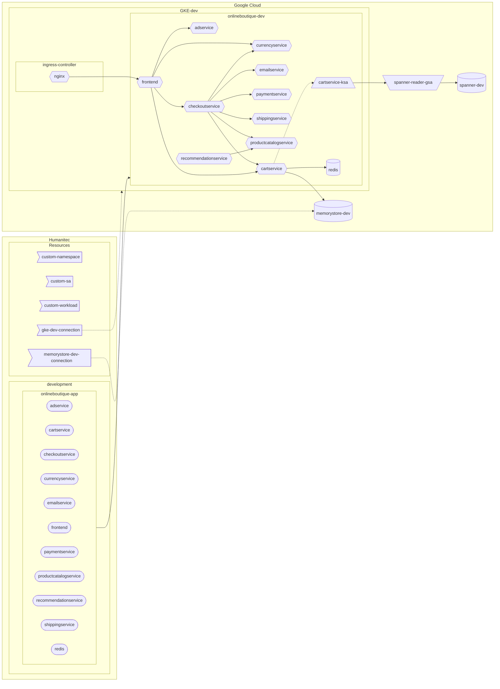

## Online Boutique

```mermaid
flowchart LR
  subgraph Humanitec
    subgraph development
        direction LR
        subgraph onlineboutique-app
            direction LR
            adservice-workload([adservice])
            cartservice-workload([cartservice])
            checkoutservice-workload([checkoutservice])
            currencyservice-workload([currencyservice])
            emailservice-workload([emailservice])
            frontend-workload([frontend])
            paymentservice-workload([paymentservice])
            productcatalogservice-workload([productcatalogservice])
            recommendationservice-workload([recommendationservice])
            shippingservice-workload([shippingservice])
            redis-workload([redis])
        end
    end
    subgraph Resources
        custom-namespace>custom-namespace]
        custom-sa>custom-sa]
        custom-workload>custom-workload]
        gke-dev-connection>gke-dev-connection]
        memorystore-dev-connection>memorystore-dev-connection]
    end
  end
  subgraph Google Cloud
    direction TB
    subgraph GKE-dev
        subgraph ingress-controller
            nginx{{nginx}}
        end
        subgraph onlineboutique-dev
            frontend{{frontend}}-->adservice{{adservice}}
            frontend-->checkoutservice{{checkoutservice}}
            frontend-->currencyservice{{currencyservice}}
            checkoutservice-->emailservice{{emailservice}}
            checkoutservice-->paymentservice{{paymentservice}}
            checkoutservice-->currencyservice
            checkoutservice-->shippingservice{{shippingservice}}
            checkoutservice-->productcatalogservice{{productcatalogservice}}
            checkoutservice-->cartservice{{cartservice}}
            frontend-->cartservice
            recommendationservice{{recommendationservice}}-->productcatalogservice
            cartservice-.->cartservice-ksa[/cartservice-ksa\]
            cartservice-->redis[(redis)]
        end
        nginx-->frontend
    end
    gke-dev-connection-.->GKE-dev
    memorystore-dev-connection-.->memorystore-dev[(memorystore-dev)]
    onlineboutique-app-->onlineboutique-dev
    cartservice-->memorystore-dev
    spanner-reader-gsa-->spanner-dev[(spanner-dev)]
    cartservice-ksa-->spanner-reader-gsa[\spanner-reader-gsa/]
  end
```
