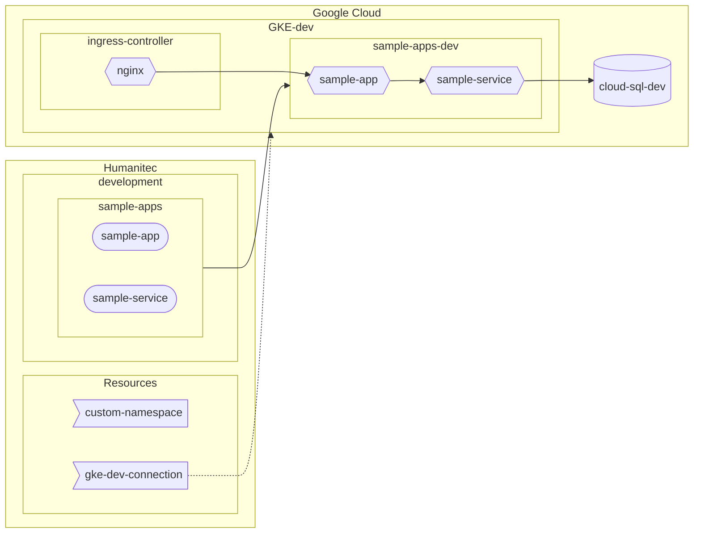

## Sample Apps

```mermaid
flowchart LR
  subgraph Humanitec
    subgraph development
        direction LR
        subgraph sample-apps
            direction LR
            sample-app-workload([sample-app])
            sample-service-workload([sample-service])
        end
    end
    subgraph Resources
        custom-namespace>custom-namespace]
        gke-dev-connection>gke-dev-connection]
    end
  end
  subgraph Google Cloud
    direction TB
    subgraph GKE-dev
        subgraph ingress-controller
            nginx{{nginx}}
        end
        subgraph sample-apps-dev
            sample-app{{sample-app}}-->sample-service{{sample-service}}
        end
        nginx-->sample-app
    end
    sample-service-->cloud-sql-dev[(cloud-sql-dev)]
  end
  sample-apps-->sample-apps-dev
  gke-dev-connection-.->GKE-dev
```
